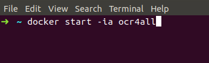

**OCR4all**

An Open Source Tool Providing a Full OCR Workflow

<u>Setup
Guide                                                                              </u>

Version 2.1, September 2019

To be always up to date, especially with a view to new image releases
and other innovations around OCR4all, please make sure to subscribe to
our mailing list
[OCR4all](https://lists.uni-wuerzburg.de/mailman/listinfo/ocr4all).

## Preparation 

-   You have to prepare the following folder structure:

    -   *ocr4all* (main folder)

        -   *models* (folder for the neural network models)

        -   *data* (folder for the documents you want to recognize)

            -   *\*work title\** (folder that contains all data of a
                single, specific print/book)

                -   *input* (folder for original, coloured/grayscaled
                    book scans on page level)

-   This structure can be created provisionally anywhere in your system.
    However, depending on your system (Linux, Windows, MacOS), you might
    have to move it later, see below.

## Choosing the right Docker version 

-   You will need the Community Edition (CE) of
    [Docker](https://www.docker.com/) for installation.

-   **Recommendation:**

    -   If you can: **Use Linux!**

    -   Else, try to use a more recent Windows version that is
        compatible with *Docker for Windows*. The procedure for the
        *Docker Toolbox* version is more complicated and error-prone.

-   For Linux:
    [<u>https://docs.docker.com/install/</u>](https://docs.docker.com/install/)
    (choose your distribution on the left)

-   For Windows:

    -   There are two ways of using Docker on Windows: *Docker for
        Windows* and the *Docker Toolbox*.

    -   *Docker for Windows*:

        -   Available for Windows 10, 64 bit: Pro, Enterprise or
            Education (Build 14393 or later; check for your version,
            which can be found in your *System Information*)

        -   [<u>https://docs.docker.com/docker-for-windows/release-notes/</u>](https://docs.docker.com/docker-for-windows/release-notes/)
            (If you do not want to register, do not chose “Download
            Docker for Windows” right away, but instead use “Download”
            under the “Stable Releases” section below)

    -   *Docker Toolbox* for other (older) versions of Windows:
        [<u>https://docs.docker.com/toolbox/toolbox_install_windows/</u>](https://docs.docker.com/toolbox/toolbox_install_windows/)

-   Mac:
    [<u>https://docs.docker.com/docker-for-mac/</u>](https://docs.docker.com/docker-for-mac/)

    -   Like with Windows, there is *Docker for Mac* und the *Docker
        Toolbox*:
        [<u>https://docs.docker.com/docker-for-mac/docker-toolbox/</u>](https://docs.docker.com/docker-for-mac/docker-toolbox/)

    -   However, these will not be covered in this guide.

**Following up, you will find three separate guides, each for a Linux
system, *Docker for Windows* and for the *Docker Toolbox* (using
Windows).**

**You can copy the different terminal commands without line breaks from
the accompanying file *calls.txt.***

## Linux

#### Docker setup

-   Follow the instructions under
    [<u>https://docs.docker.com/install/</u>](https://docs.docker.com/install/)
    …

*Fig. 1: Choose Linux under Docker CE. Fig. 2: Choose your Linux version
and follow the instructions*.

-   … and appreciate that everything works without further adjustments!

#### OCR4all setup

-   The OCR4all folder structure detailed above (“Preparation”) can be
    located anywhere you want.

-   **Open a terminal inside the OCR4all folder** and load an OCR4all
    image by using the following command (this will take up a few
    minutes and requires a stable connection to the internet):

*docker pull ls6uniwue/ocr4all*

*Fig. 3: Load the OCR4all image via a terminal inside the OCR4all
folder.*

-   Create the OCR4all container using the following command:

> *docker run -p 1476:8080 -p 5000:5000 -u \`id -u root\`:\`id -g
> $USER\` --name ocr4all \\  
> -v $PWD/data:/var/ocr4all/data \\  
> -v $PWD/models:/var/ocr4all/models/custom \\  
> -it ls6uniwue/ocr4all*

(Once again, this may take a while)

*Fig. 4: Create an OCR4all container.*

#### Browser access and further use

-   OCR4all is optimized for Chrome/Chromium.

-   Browser access:
    [<u>http://localhost:1476/OCR4all_Web/</u>](http://localhost:1476/OCR4all_Web/)

-   To check if the mapping (e.g. “-v *$PWD/data:/…”*) is working
    properly, move the folders of the example projects “Cirurgia” and
    “GNM” from this
    [repository](https://github.com/OCR4all/getting_started)
    (*getting_started/ocr4all/data/…*) to your mapped directory. In the
    browser tool, check *Project Overview* -> *Project selection:* If
    you can find the two books called “Cirurgia” and “GNM” the mapping
    is working as intended.

*Fig. 5: Project Overview – mapping is working.*

Otherwise, it´s likely that there was a typo in the “docker run”
command, so you will have to create the container again. First, delete
the container you just created:

Stop the process in the terminal using *CTRL+C*, then type:*  
docker rm ocr4all*

> Check and correct your command (as with most terminals, you can sift
> through your previous commands using the arrow keys), especially the
> “-v *$PWD/data:/…*”-lines, then run it again.

-   If everything is set up properly, you can (and should!) restart
    OCR4all in the future by using:

*docker start –ia ocr4all*

*Fig. 6: Command to (re-)start OCR4all.*

## Docker for Windows

#### Docker setup

-   Follow the installation guide under
    [<u>https://docs.docker.com/docker-for-windows/release-notes/</u>](https://docs.docker.com/docker-for-windows/release-notes/).

*Fig. 7: Download the latest Docker for Windows version from “Stable
release notes”.*

Make sure to give all needed permissions, install all additional drivers
etc.

-   Start Docker.

-   Adjust the Docker settings (Right-click on the Docker symbol in the
    hidden bottom-right toolbar, then chose *Settings*):

    -   *Shared Drives*: Chosen drive (or partition).

        -   You will need at least one. Our recommendation: Simply use
            “C:”.

*Fig. 8: Shared drives.*

-   Click *Apply*. (Attention: This requires a valid, non-empty Windows
    password. Changing or removing the password later results in a
    silent removal of your Docker privileges!).

<!-- -->

-   *Advanced*: Adjust CPUs (max) and Memory (2GB+) if you want to.

> 
>
> *Fig. 9: Adjust CPUs and Memory if you want.*

#### OCR4all setup

-   Move the OCR4all folder structure detailed above (“Preparation”) to
    the shared drive (or partition). In the following example, we use
    “C:\\Users\\Public\\ocr4all\\...”. We recommend to use the same for
    the first setup.

-   **Inside the OCR4all folder, open PowerShell** (Shift + right click
    inside OCR4all folder -> Open PowerShell window here) and load an
    OCR4all image using the following command (this will take up a few
    minutes and requires a stable connection to the internet):

*docker pull ls6uniwue/ocr4all*

*Fig. 10: Load the OCR4all image via Windows PowerShell inside the
OCR4all folder.*

-   Create the OCR4all container using the following command (Note: this
    works only for the recommended setup, i.e. when the OCR4all folder
    is located in “C:\\Users\\Public\\...”)

> *docker run -p 1476:8080 -p 5000:5000 --name ocr4all*
>
> *-v **C:\\Users\\Public\\ocr4all\\data**:/var/ocr4all/data*
>
> *-v **C:\\Users\\Public\\ocr4all\\models**:/var/ocr4all/models/custom*
>
> *-it ls6uniwue/ocr4all*

Alternatively, you will have to adjust the paths marked in bold print.

-   Use absolute paths!

-   Use auto completion!

-   It is recommended to not use print working directory (PWD) in this
    case.

#### Browser access and further use

-   OCR4all is optimized for Chrome/Chromium.

-   Browser access:
    [<u>http://localhost:1476/OCR4all_Web/</u>](http://localhost:1476/OCR4all_Web/)

-   To check if the mapping (e.g. “-v
    *C:\\Users\\Public\\ocr4all\\data:/…”*) is working properly, move
    the folders of the example projects “Cirurgia” and “GNM” from this
    [repository](https://github.com/OCR4all/getting_started)
    (*getting_started/ocr4all/data/…*) to your mapped directory. In the
    browser tool, check *Project Overview* -> *Project selection:* If
    you can find the two books called “Cirurgia” and “GNM” the mapping
    is working as intended.

*Fig. 11: Project Overview – mapping is working.*

-   Otherwise, there might be a typo in the “docker run” command, so you
    will have to create the container again. First, delete the container
    you just created:

Stop the process in PowerShell using *CTRL + C*, then type:*  
docker rm ocr4all*

> Check and correct your command (as with most terminals, you can sift
> through your previous commands using the arrow keys), especially the
> two “-v C:\\Users\\...”-lines, then run it again.

-   If everything is set up properly, you can (and should!) restart
    OCR4all in the future by using

*docker start –ia ocr4all*

## Docker Toolbox (for older Windows versions)

#### Docker setup

-   Follow the installation guide at
    [<u>https://docs.docker.com/toolbox/toolbox_install_windows/</u>](https://docs.docker.com/toolbox/toolbox_install_windows/).

*Fig. 12: Choose “Install Toolbox on Windows” and follow the
instructions*.

-   Make sure to give all needed permissions, install all additional
    drivers etc.

-   Start Docker Quickstart Terminal and wait for all processes to
    finish (Give the needed permissions; this needs a stable internet
    connection).

*Fig. 13: Wait for all processes to finish*.

-   Close Docker Quickstart Terminal.

-   Open Oracle VM Virtual Box.

    -   Right click on *default* -> *Close* -> *Turn Off*.

> 

*Fig. 14: Turn off “default”*.

-   Click on *default* -> *Change* -> *System* -> Adjust CPUs (max) and
    Memory (2GB+) if you want to -> OK.

> 

*Fig. 15: Adjust CPUs to maximum*.

> 

*Fig. 16: Adjust Memory to 2GB+*.

-   It is possible to share additional drives (partitions), however this
    is quite complicated and is not recommended or explained further at
    this point.

<!-- -->

-   Start Docker Quickstart Terminal again.

> 

*Fig. 17: Start Docker Quickstart Terminal again*.

#### OCR4all setup

-   Move the OCR4all folder structure detailed above (“Preparation”)
    directly into a folder inside C:\\Users. In the following example,
    we use “C:\\Users\\Public\\ocr4all\\...”. We recommend to use the
    same for the first setup.

-   **Inside the OCR4all folder, open PowerShell** (Shift + right click
    inside OCR4all folder -> Open PowerShell window here) and load an
    OCR4all image using the following command (this will take up a few
    minutes and requires a stable connection to the internet):

*docker pull ls6uniwue/ocr4all*

*Fig. 18: Load the OCR4all image via Windows PowerShell inside the
OCR4all folder.*

-   If necessary, open the **Docker Quickstart Terminal** again and
    create the OCR4all container using the following command (Note: this
    works only for the recommended setup, i.e. when the ocr4all folder
    is in C:\\Users\\Public\\...)

> *docker run -p 1476:8080 -p 5000:5000 --name ocr4all*
>
> *-v **/c/Users/Public/ocr4all/data**:/var/ocr4all/data*
>
> *-v **/c/Users/Public/ocr4all/models**:/var/ocr4all/models/custom*
>
> *-it ls6uniwue/ocr4all*
>
> 
>
> *Fig. 19: Create an OCR4all container.*

-   Alternatively, you will have to adjust the paths marked in bold
    print.

    -   Use absolute paths!

    -   Use auto completion!

    -   It is recommended to not use print working directory (PWD) in
        this case.

#### Browser access and further use

-   OCR4all is optimized for Chrome/Chromium.

-   Browser access:
    [<u>http://192.168.99.100:1476/OCR4all_Web/</u>](http://192.168.99.100:1476/OCR4all_Web/)

-   To check if the mapping (e.g. “-v
    */c/Users/Public/ocr4all/data:/…”*) is working properly, move the
    folders of the example projects “Cirurgia” and “GNM” from this
    [repository](https://github.com/OCR4all/getting_started)
    (*getting_started/ocr4all/data/…*) to your mapped directory. In the
    browser tool, check *Project Overview* -> *Project selection:* If
    you can find the two books called “Cirurgia” and “GNM” the mapping
    is working as intended.

*Fig. 20: Project Overview – mapping is working.*

Otherwise, it´s likely that there was a typo in the “docker run”
command, so you will have to create the container again. First, delete
the container you just created:

Stop the process in the Docker Quickstart Terminal using *CTRL + C*,
then type:  
*docker rm ocr4all*

> Check and correct your command (as with most terminals, you can sift
> through your previous commands using the arrow keys), especially the
> two “-v…”-lines, then run it again.

-   If everything is set up properly, you can (and should!) restart
    OCR4all in the future by using

> *docker start –ia ocr4all*
>
> 
>
> *Fig. 21: Command to (re-)start OCR4all.*
