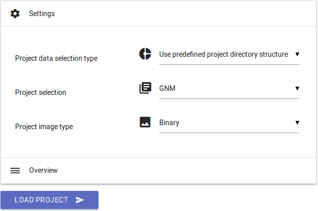

OCR4all –

An Open Source Tool Providing a Full OCR Workflow

<u>Short Guide</u>

Version 2.0, May 2019

To be always up to date, especially with a view to new image releases
and other innovations around OCR4all, please make sure to subscribe to
our mailing list
[OCR4all](https://lists.uni-wuerzburg.de/mailman/listinfo/ocr4all).

# 1 Introduction

As suggested by the name one of the main goals of OCR4all is to allow
basically any given user to independently perform OCR on a wide variety
of historical printings and obtain high quality results with reasonable
time expenditure. Therefore, OCR4all is explicitly planned even for
users with no technical background.

OCR4all was initially designed to support the OCR of (very) early
printed books which was considered basically impossible only a few years
ago. Users dealing with such early prints are usually prepared to accept
a certain amount of manual effort due to the fact that a time consuming
layout analysis and book specific model training are often imperative
due to complex layouts and highly variant typography.

In view of the foregoing the following short guide is aimed at giving a
brief but highly precise overview about the OCR4all workflow on the
whole as well as detailed instructions for its individual modules. By
following the guidelines, the user gets qualified to perform a full OCR
workflow on his own in order to produce different types of output data
(text of PageXML) without further support.

# 2 Workflow

Fig. 1 shows the main steps of the workflow implemented in OCR4all.
After acquiring the scans and an optional preparation step the original
images can be placed into the workspace, i.e. a book directory located
in the data directory which was defined during the setup phase.

*Figure 1. The main steps of the OCR4all workflow as well as two
preceding steps which are not part of the main tool.*

Next, a preprocessing is applied to the scans before several steps, i.e.
region segmentation and extraction as well as the line segmentation,
produce the line images required as input for the character recognition
or the ground truth production. The output of the character recognition
can either directly serve as the final result or can be corrected by the
user which allows the training of more accurate book-specific models,
yielding better recognition results.

The following descriptions refer to two exemplary prints, “GNM” (a
typical fraktur print from the 19th century) and “Cirurgia” (a early
modern fraktur print). They will be used to illustrate different
capabilities of OCR4all according to variable user input, which means
probably prints from more than five centuries. Therefore, this brief
instruction shows in a first step a fully automated run of process flow
with the help of “GNM” because of its comparatively simple layout. In
addition, “Cirurgia” will be used to represent a gradually workflow as
recommended for early modern prints with complex layout.

## 2.1 Selecting a book to process

-   **Expected input format for a book**: .../data/\*book
    name\*/input/\*images\*.

-   According to your installation instructions start OCR4all.

-   Now open OCR4all on your web browser, go to “Settings” and select
    “GNM” from the “Project selection” dropdown.

-   If necessary, change “Project image type” to “Binary” and then hit
    “Load Project”.

*Figure 2. Selecting a book to process.*

## 2.2 Project Overview

-   The “Project Overview” shows the progress of your project on a page
    basis. For every single page (s. different lines) a check mark
    signals which steps of the workflow (s. different columns) have
    already been executed.

*Figure 3. Project Overview.*

-   By selecting a page´s “Page Identifier” you can get a closer look at
    the already produced output like the original image, different
    preprocessing steps, extracted segments or segmented lines.

## 2.3 Process Flow – A fully automated run

If you want to use OCR4all especially for prints with relatively simple
layout (as we do with “GNM” at this steps of our manual), there is an
option to perform a fully automated run of the different modules that
are part of the workflow.

-   Select “Process Flow” from the menu (☰) on the top left.

-   Open “Process Selection” and choose all recommended workflow modules
    to generate line segments to respectively enable the recognition as
    shown in Fig. 4.

*Figure 4. Process Selection.*

-   Make sure all pages you want to work with are selected on the right
    “Pages” column.

-   Choose “default/fraktur_19th_century” as your OCR model (“Settings”
    → “Recognition” → “Line recognition models – Available”).

*Figure 5. Selecting an OCR model.*

-   Generally, its possible to select more than just one OCR model to
    perform recognition. However, it is recommended only if there is a
    mixture of letters used in your printing.

-   If you work locally make sure you use all available CPUs (auto
    detect).

-   Hit “Execute” and wait for the success notification.

-   To check your results, go to “Ground Truth Production” (☰).

-   A new tab opens:

*Figure 6. Line images are corresponding with OCR results.*

-   The line images are aligned with the corresponding OCR result.

-   If you want to correct your lines respectively your produced OCR
    text on the whole before generating results (s. “Result Generation”)
    go to chapter “Ground Truth Production”.

The preceding instructions referred to prints with comparatively very
simple layout structures for which it is for example not necessary to
perform a specific layout analysis and segmentation. In addition, this
short guide will deal with much more complex printings, so there will be
a much detailed insight into the individual modules. Therefore, we leave
“GNM” behind and turn towards “Cirurgia”.

## 2.4 Preprocessing

**Input:** original image (colour, grayscale or binary).

**Output:** deskewed binary (and grayscale) image(s).

During the preprocessing step the input image gets converted into a
binary and (optionally) a normalized grayscale image. Additionally, a
deskewing operation can be performed.

-   **Select “Cirurgia” as book and set “Project image type” to
    “Gray”.**

-   Select “Preprocessing” from the menu.

-   Set “Skew angle estimation parameters” to “0” and perform a run.

*Figure 7. Preprocessing settings.*

-   Check the results by selecting preprocessed pages in the “Project
    Overview” view respectively their “Page Identifiers”.

## 2.5 Noise Removal

**Input:** noisy binary image.

**Output:** binary image with no/less noise.

As workflow option “Noise Removal” detects contours und removes the ones
smaller than a given area threshold. Although its unnecessary for most
books and should therefore be left out, it is very effective for
removing very fine noise and can be very useful when using LAREX for
segmentation.

-   Go to “Noise Removal”.

-   Select a single page from your “Pages” column on the right and
    perform a run while maintaining all the defaults.

-   To check your result, select the very page on “Pages” once again and
    then choose “Image Preview”. Compared to your binary image all red
    contours have been removed at the despeckled one on the right. If
    you are satisfied by your result perform “Noise Removal” for all
    pages that are still missing.

-   If there is too much loss on your page (full stops, semicolons,
    parts of woodcuts etc.) play around with the “Maximal size for
    removing contours” value and reduce it. Then perform another run on
    your selected page and check your result once again.

*Figure 8. Noise Removal settings.*

## 2.6 Segmentation – LAREX

**Input:** preprocessed images.

**Output:** structural information about regions (position and type) and
their reading order.

The general goal of this step is to identify and optionally classify
layout regions in the scan of a print page.

-   Go to “Segmentation” → “LAREX”.

-   Select “Binary” as input images if you missed “Noise Removal” out
    and “Despeckled” if you performed “Noise Removal”. Afterwards hit
    “Open LAREX”.

-   **A short user manual is available**
    [here](http://www.is.informatik.uni-wuerzburg.de/fileadmin/10030600/Mitarbeiter/Reul_Christian/Projects/Layout_Analysis/LAREX_Quick_Guide.pdf)**.**
    Follow the instructions. Please note that this LAREX short guide
    does not use “Cirurgia” as its example. Nevertheless, the indicated
    instructions are transferable. An updated version will be handed in
    later.

-   When finished simply close the tab.

## 2.7 Region Extraction

**Input:** preprocessed image and segmentation information as PageXML.

**Output:** extracted, deskewed text region images.

Next, the text regions identified during the segmentation step need to
be extracted from the page images. This is done by cutting out the
polygons stored in the PageXML file from the corresponding grayscale or
binary image.

-   Book: “Cirurgia”.

-   Select “Region Extraction” from the menu.

-   Keep all settings to the default: ten pixel spacing around the
    regions, white background.

*Figure 9. Region Extraction settings.*

-   Hit “Execute” and check the results in the “Project Overview”.

## 2.8 Line Segmentation

**Input:** deskewed region images.

**Output:** extracted text lines.

-   Go to “Line Segmentation”.

-   Keep all settings to the default.

-   **Important parameter**: “Maximum # of whitespace column
    separators”.

    -   Controls the column detection.

    -   A value of “-1” skips the search for columns. By setting this
        value the user guarantees with segmentation results from LAREX
        in mind there are no columns in the prints layout at all.

    -   In contrast a value of “3” means there is a layout two columns
        and three column separators.

-   Hit “Execute” and check the results in the “Project Overview” or by
    using “Ground Truth Production”.

*Figure 10. Line Segmentation settings.*

## 2.9 Recognition

**Input:** text line images and one or several OCR models.

**Output:** textual OCR output on line level.

After segmenting the pages into lines it is now possible to perform OCR
on the results. In general, the recognition module allows to either
apply self trained book specific models, or to resort to so called mixed
models. These models have been trained on a wide variety of books and
typesets and can usually provide at least a valid starting point to
start off the iterative training. OCR4all comes with four standard
models which are automatically incorporated. **Besides there are more
mixed model ensembles**
[**here**](https://github.com/Calamari-OCR/calamari_models).

-   Select “Recognition” from the menu.

-   Select the complete voting ensemble (0-4) of “fraktur_historical” or
    the single standard model “default/fraktur_historical” (if
    fraktur_historical is not available) as “Line recognition model(s)”.
    For this you can also use the “*Search*”-filter.

-   If you use more than just one model voting is initialized
    automatically. It slows the running process but provides more
    accurate results.

*Figure 11. Selecting models as line recognition models.*

-   Make sure you have selected several pages on the “Pages” column on
    the right for which you want to perform a first recognition run. It
    is not recommended to perform the recognition for your book on the
    whole at this first run.

-   Hit “Execute” and check the results by using “Ground Truth
    Production”.

## 2.10 Ground Truth Production

**Input:** line image and the corresponding OCR output, if available.

**Output:** line based ground truth.

Ground truth is required for the upcoming OCR model training.

-   Go to “Ground Truth Production”.

-   Select a line by clicking on the OCR text.

-   Make corrections (if necessary) by typing regularly or selecting
    characters from the configurable virtual keyboard on the right which
    allows to insert special characters. To add book specific characters
    to the keyboard hit “Edit” and insert Unicode.

*Figure 12. Ground Truth Production.*

-   The ground truth is saved (green coloured background) when the line
    gets deselected.

-   After finishing your ground truth production close the tab.

## 2.11 Evaluation

**Input:** line-based OCR predictions and the corresponding ground
truth.

**Output:** error statistics.

The evaluation module enables an objective assessment of the recognition
quality achieved by the models at hand. For a given selection of pages,
it compares the OCR results to the corresponding ground truth and
calculates the so called character error rate. Additionally, a confusion
table shows the most common OCR errors and their frequency of
occurrence.

-   Select “Evaluation” from the menu.

-   Make sure you have only selected those pages from the “Pages” column
    you have chosen before for your latest recognition run. Otherwise
    your results will not refer to used recognition model and its
    efficacy.

-   Keep all settings to the default and hit “Execute”.

*Figure 13. Evaluation results with character error rate and table of
most common OCR errors.*

## 2.12 OCR Model Training

**Input:** line images with corresponding ground truth, optionally
already existing models to build from.

**Output:** one or several OCR models.

The OCR model training allows to train book-specific models for using
them at the recognition module to improve text recognition by including
book-specific features compared to standard mixed models.

-   Go to “Training” → “Settings (General)”.

-   Keep most of the settings to the default but change “Pre-Training”
    to...

    -   “Train each model based on different existing models” if you
        performed recognition with “fraktur_historical” (0-4) **as
        recommended**; enter “fraktur_historical/1” to the following
        “Pre-Training for model 1”-dropdown and so on till
        “fraktur_historical/4” to the “Pre-Training for model
        5”-dropdown.

    -   “Train all models based on one existing model” if you performed
        recognition with the single model “default/fraktur_historical”
        which should be normally avoided; enter
        “default/fraktur_historical” to the following “Pre-Training for
        model: All”-dropdown.

-   The indication Pre-Training models ensures a use of specific prior
    knowledge to improve and to speed up the training process.

*Figure 14. Settings for OCR model training.*

-   Hit “Execute”. Especially depending on hardware (number of available
    CPUs etc.) and quantity of line images and corresponding ground
    truth the duration of training varies and can not be determined
    precisely.

-   Finally, a book-specific model ensemble is getting produced. Its
    single models get named after your OCR4all project, in this case
    “Cirurgia/0/0” till “Cirurgia/0/4”. They can be used for further
    recognition at the corresponding module without further ado.

## 2.13 Result Generation

**Input:** OCR results on line basis, optionally ground truth (if
present) and additional data obtained from the region and line
segmentation steps.

**Output:** final output as text (lines combined to pages and the entire
book) and PageXML files on page basis.

In this step the achieved results are gathered and combined into
standard output formats for further processing outside of OCR4all.

-   Book: “Cirurgia”.

-   Select “Result Generation” from the menu.

*Figure 15. Result Generation.*

-   Run the extraction by hitting “Execute” and using both available
    “Result file types” one after another.

# 3 Contact and additional help

Contact: <chrstian.reul@uni-wuerzburg.de>,
<maximilian.wehner@uni-wuerzburg.de>

GitHub: <https://github.com/OCR4all>

Mailing list: <https://lists.uni-wuerzburg.de/mailman/listinfo/ocr4all>

Brief instruction by <maximilian.wehner@uni-wuerzburg.de>
