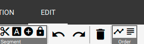
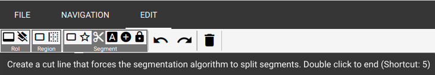

OCR4all – An Open Source Tool Providing an Easy to Use (Semi-)Automatic
OCR Workflow for Historical Printings

<u>User Guide</u>

Version 2.0, May 2019

To be always up to date, especially with a view to new image releases
and other innovations around OCR4all, please make sure to subscribe to
our mailing list
[OCR4all](https://lists.uni-wuerzburg.de/mailman/listinfo/ocr4all).

# Contents

1\. OCR4all 2

1.1 Introduction 2

1.2 Setup and file structure 3

2\. Preparation of scans and images (Scantailor) 3

3\. Start and Overview 4

3.1 Start OCR4all 4

3.2 Project Overview 4

4\. Workflow 6

4.2 Preprocessing 7

4.3 Noise Removal 8

4.4 Segmentation – LAREX 9

4.4.1 Defaults 9

4.4.2 Overview and EDIT 10

4.4.3 Specific settings: Regions, Parameters, Reading Order, Settings 12

4.4.4 Exemplified Segmentation of a scan 15

4.4.5 Further editing options 18

4.4.6 End of Segmentation with LAREX 20

4.5 Region Extraction 20

4.6 Line Segmentation 21

4.7 Recognition 22

4.8 Ground Truth Production 22

4.9 Evaluation 24

4.10 OCR Model Training 24

4.11 Result Generation 26

5\. Errors, frequent problems and their evasion 27

# 

# 1. OCR4all

## 1.1 Introduction

OCR4all
is a software designed to digitally explore primarily very early printed
texts whose elaborate printing types and often uneven layout concepts
are beyond the recognition abilities of most other recognition software.
Understandably and independently to use, OCR4all’s suggested workflow
also explicitly focusses users with no technical background and combines
different tools in one consistent interface. A frequent change between
software is not necessary anymore.  
  
From the images’ preparation (“Preprocessing”) via the layout
segmentation (“Region Segmentation” with LAREX), the extraction of
classified layout regions (“Region Extraction”), the segmentation of
lines (“Line Segmentation”) and character recognition (“Recognition”) to
the identified characters’ correction (“Ground Truth Production”) and
the building of book specific OCR-models in one software, OCR4all
describes an adequate OCR-workflow (s. fig. 1).

*Fig. 1: OCR4all workflow’s main constituents.*

Especially due to the possibility to forge and train book specific
recognition models theoretically also applicable on other printings,
OCR4all is able to achieve very good results in digital character
recognition. Regarding its total concept, this guide provides an
extensive and detailed insight in work and possible application of
OCR4all within the scope of OCR especially of early printings. While
chapter 1 explains setup and file structure, chapter 2 treats a
recommended preparation of scans and images outside of OCR4all aimed at
the results’ improvement and the various steps’ facilitation within
OCR4all. Chapter 3 examines starting OCR4all as well as an overview of
its fundamental functions. The following chapter 4 offers a very
detailed view on the different consecutive sub modules of above
described OCR workflow and presents the initial editing of printings and
creation of OCR texts practically. The concluding fifth chapter treats
the current most frequent user problems.

## 1.2 Setup and file structure

As soon as OCR4all has been installed completely, the file “ocr4all”
with its sub files “data” and “models” offers a basic and necessary file
structure for editing works.

“data” both saves all data a user wants to edit in OCR4all and stores
data created during the OCR-workflow in OCR4all. For this purpose, in
“data” needs to be established a file for the book itself (please evade
mutated vowels and blanks during the naming!) containing another file
named “input” (insert the scans/images here). While proceeding using
OCR4all, more files will be added automatically to the “input”-file,
carrying and saving the different edition steps of the scans/images.

In “models”, general mixed models made for recognition can be stored
(see a selection [here](https://github.com/OCR4all/ocr4all_models)).
Also book specific models created with OCR4all will be stored in the
work’s file. As soon as the process of training starts, the newly
created models will be numbered (starting at “0”) and stored in the
“models/*name-of-work/book*” file.

# 2. Preparation of scans and images (Scantailor)

Very often, the works to produce an OCR from are merely available as
facsimiles. While their individual images will mostly have a good to
very good quality, their general condition will not be fit for a direct
import into OCR4all. Such a case would be images also picturing i. e.
the book cover or back or parts of the bearing surface. By binarizing
such images during the workflow, different contrasts in the originals
will cause black dividing lines both problematic for OCR and
segmentation. The rotation of scans or displaying two pages per scan
also offer problems.

These problems can be evaded by preparing the images suitably very
easily: The goal thus must be using scans showing only those contents
supposed to be recognised. At the same time, these scans should – beside
the contents – also offer a reasonable amount of free space at the
margins in order not to make certain parts of the segmentation more
complicated than necessary. So it’s useful to both remove explicitly
those parts of the image not belonging to the actual book page and thus
need not be recognised and simultaneously sustain as much as possible of
the original printing page (i. e. not cutting away the margins
completely).

Theoretically, all image editing software is suitable for this task. In
this case though, “Scantailor” is recommended for it can edit and
standardize big amounts of images in a relatively short span of time.
Detailed guides and videos can be found
[here](https://github.com/scantailor/scantailor/wiki).

3\. Start and Overview

## 3.1 Start OCR4all

-   **Start Docker:**

<!-- -->

-   Linux: Docker starts automatically by starting the computer

-   Docker for Windows: Start docker via Docker-Icon in “programs”, wait
    for “Docker is running”

-   Docker Toolbox: Open Docker Quickstart Terminal, wait for “Docker is
    configured to use default machine...”

<!-- -->

-   **Start OCR4all:**

<!-- -->

-   Linux: Open terminal, type “docker start -ia ocr4all” and confirm
    via “Enter”, wait for start of server

-   Windows 10 (Pro, Enterprise, Education): Open Windows PowerShell,
    type command “docker start -ia ocr4all”, confirm via “Enter”, wait
    for start of sever

-   Older Windows versions (with Docker Toolbox): type “docker start -ia
    ocr4all” in the Docker Quickstart Terminal, confirm via “Enter”,
    wait for start of server

<!-- -->

-   Afterwards, **OCR4all can be selected in the browser** according to
    used docker-version in following domains:

<!-- -->

-   Linus, Docker for Windows, MacOS:
    <http://localhost:1476/OCR4all_Web/>

<!-- -->

-   Docker Toolbox: <http://192.168.99.100:1476/OCR4all_Web/>

##  3.2 Project Overview

By opening OCR4all within the browser, the user automatically reaches
the home page “Project Overview”:

-   ‘**Settings**’:
    The option ‘settings’ enables to select the work which shall be
    edited. For this purpose, the respective work created beforehand as
    file in ocr4all/data/*work’s title* (s. 1.2.) is selected in
    ‘Project Selection’ from a dropdown list. Additionally, ‘Gray’ will
    be selected in ‘Project image type’.

> *Fig. 2: Settings in Project Overview.*

-   After selecting the work follows loading it by hitting “LOAD
    PROJECT”. As OCR4all demands certain, prescripted data file naming
    and types (0001.png and so on), “LOAD” can cause a request to
    convert. This can be done in OCR4all.

> *Fig. 3: Possible data conversion.*

-   In “**Overview**”, the tabular structured, momentary state of the
    loaded work’s edition always can be viewed. Each page of the edited
    work receives an individual line as “Page Identifier” while columns
    (from left to right) depict the typical and suggested OCR4all
    workflow. By editing certain steps of the overall workflow, the
    corresponding pages will be marked as “edited” (check) within the
    overview. With “Show...entries” and “Search”, the display can be
    changed manually, and especially extensive works can be searched.

> *Fig. 4: Overview.*

-   By hitting individual “**Page Identifier**”, both condition of
    editing and already available data can be viewed during the whole
    process. The columns “Images” and “Segments” offer this as well as
    the options “Original”, “Binary”, “Gray” and “Noise Removal”.

# 4. Workflow

OCR4all generally offers two different alternatives for OCR workflows
which can differ extremely in energy expend, almost necessarily in
verifiability of part results and thus the produced data’s quality. In
the following, both alternatives will be introduced and classified.  
  
4.1 Process Flow

The option “**Process Flow**” (main menu ☰ → Process Flow) offers an
almost fully automated workflow. In it, merely those scans which should
be edited are selected from the right-side bar and afterwards, by
respective checks, all work steps which are supposed to be executed on
the data.

> 
>
> *Fig. 5: Parts of the “Process Flow”.*

Only the step “Recognition” requires selecting a suitable OCR model or
model package (five simultaneous and interacting individual models, s.
also Chap. 4.7) for the recognition. Use “Settings” → “Recognition” →
“General” as depicted in the following image, from the list of all
available OCR models (“Line recognition models – Available”).

> 
>
> *Fig. 6: Selecting a suitable OCR model.*

It’s generally possible to select more than one model for the
recognition. It’s only recommended though, if different types occur
within the edited text.

“EXECUTE” starts the “Process Flow”. The individual part module’s
process notification enables trailing the current state of editing.
After a complete run of the workflow, the results can be checked in the
option “Ground Truth Production” (☰).

> 
>
> *Fig. 7: Lines with corresponding OCR result.*

If the created OCR lines correspond to wished or requested accuracy,
final results can already be created (TXT and/or PageXML) via “Result
Generation” (☰). If they do not, they can be corrected before the result
generation (s. Chap. 4.8).

Besides the “Process Flow”, OCR4all also offers the possibility of a
sequential workflow in which the user runs the different part modules
independently (s. fig. 1) in order to guarantee the produced data’s
correctness and quality. As the separate part modules are based on each
other, this approach seems sensible especially for very early printings
and their complex and extensive layout.

It’s recommended particularly to first time users to run the following
step-by-step OCR workflow at least once in order to understand the
function of the individual part modules.

## 4.2 Preprocessing

**Input:** original image (coloured, grayscale or binary).

**Output:** deskewed binary (and grayscale) image.

-   This step aims at creating binary and grayscale images providing the
    foundation for a successful segmentation and OCR.

-   All scans supposed to be edited are selected at the right hand
    sidebar; all settings (“Settings (General)” and “Settings
    (Advanced)” remain, meaning both the to be edited image’s angle
    remains unchanged as well as the automatically generated number of
    used CPUs by the part module (the latter concerns all of OCR4all‘s
    following part modules!)

> 
>
> *Fig. 8: Settings for preprocessing.*

-   Binarization can be started by hitting “EXECUTE”. The step’s
    progress can be followed within the console, more precisely in
    “Console Output”. If necessary, warnings are dispensed during the
    binarization in “Console Error”. They do not affect the
    binarization’s result though.

-   The binarization’s success can be controlled in “Project Overview”
    via hitting any “Page Identifier” or the display screen “Binary”.
    Additionally, there should be checks for all edited images in the
    project overview’s column “Preprocessing”.

## 4.3 Noise Removal

**Input:** noisy binary image.

**Output:** binary image with no/less noise.

-   The option “Noise Removal” can delete minor pollution like blotches
    or spots on from scans.

-   For using “Noise Removal”, hit the corresponding step in the main
    menu and select those scans to be edited in the right-hand sidebar.
    Adopt all defaults at first and, after hitting “EXECUTE”, examine
    the results on a trial basis by hitting the respective scan’s
    lettering on the right-hand sidebar. In “Image Preview”, you can now
    view the comparison of unedited and edited image. Red pigmented
    image elements have been deleted in this step.

> *Fig. 9: Settings for noise removal.*

-   In case too many disturbing elements are left on the scan,
    tentatively increase the magnitude of “Maximal size for removing
    contours”, repeat the step by hitting “EXECUTE” again and once again
    control the results.

-   In case too many image elements have been removed, correct the
    magnitude of “Maximal size for removing contours” downwards.

-   Repeat the process until content with the results.

## 4.4 Segmentation – LAREX

**Input:** preprocessed images.

**Output:** structural information on regions (position and type) and
their reading order.

LAREX serves as segmentation tool, structuring and classifying the
printing pages’ layout for further editing steps. The basic assumption
lies within a repeating pool of different layout elements used for
especially early printings, making them consistent to a certain degree.
Thus, users can rely upon different tools and aids to structure a
printing page (segment it) in a way to adequately determine all
information concerning the layout for the workflow’s following steps.
This includes besides the basic distinction text versus non-text (i. e.
text versus image/woodcut) and their further specification (i. e. for a
text headline, main text, page number) also information concerning the
reading order (meaning order of reading and usage) of the existing
elements.

###  4.4.1 Defaults

-   Menu: “Segmentation” -› “LAREX”.

-   “Segmentation image type”: “Binary” in case the process should be
    continued with binarized data; “Despeckled” in case the step “Noise
    Removal” has been executed before.

<!-- -->

-   “OPEN LAREX” -› “LAREX” opens in new tab.

> *Fig. 10: LAREX settings.*

In
the middle, the first of all selected scans is displayed. There already
exist first segmentation results generated by the automatic segmentation
of each scan as soon as it’s being selected for the first time. These
results are not saved. It is now the user’s job to further determine
settings meant to adapt the displayed automatic segmentation results to
the respective work’s layout or add manual corrections in order to
achieve a correct segmentation result.

> *Fig. 11: home page and automatic segmentation results.*

### 4.4.2 Overview and EDIT

In the left-hand sidebar, all selected and to be edited scans are
displayed. Corresponding to their edition status, the receive different
coloured markings in the right bottom corner:

-   Exclamation mark, orange: “There is no segmentation for this page.”
    – There are no segmentation results for this page at the moment.

-   Warning triangle, orange: “Current segmentation may be unsaved.” –
    The current segmentation results might not be saved yet (s. below).

-   Disk, green: “Segmentation was saved in this session.” – There are
    saved segmentation results for this scan saved as XML data.

-   Lock, green: “There is a segmentation for this page on the server.”
    – The individual saved segmentation results have been confirmed
    after ending the whole work’s segmentation as correct. (s. below).

> 
>
> *Fig. 12: different states of editing.*

The head runner offers the options “FILE”, “NAVIGATION” and “EDIT”:

> 
>
> *Fig. 13: Head runner’s different menu items.*

-   **FILE**: There are not settings or changings necessary for the
    LAREX version integrated in OCR4all!

-   **NAVIGATION**: The here possible settings structure the general
    display of scans and images in LAREX, i. e. the scan’s position
    within the viewer or certain zoom settings. These settings also can
    be changed via mouse and/or touchpad (simple moving of the displayed
    scan by keeping the mouse’s/touchpad’s left area held and moving the
    mouse/touchpad; zoom via scrolling or touchpad’s zoom settings).

-   **EDIT**: The different options of editing a scan are displayed
    here, complemented by the right-hand sidebar. While options running
    under “EDIT” generally are made for the respective scan’s specific
    editing (s. below), work based and global options are displayed on
    the right hand sidebar.

> 

*Fig. 14: Right sidebar’s settings.*

However, they always can be complemented, changed and adapted. It’s
helpful and sensible in this case to always save all influenced settings
regarding the recognition parameters (“Parameters”) and the layout
elements determined by the user and given in the work to be able to use
them again when using LAREX again. It enables working with work specific
settings.

### 4.4.3 Specific settings: Regions, Parameters, Reading Order, Settings

-   “**Regions**”: Each scan (and with it work’s and text) page
    consists, following the idea and concept of LAREX, of different
    layout elements. These include i. e. main text (paragraph),
    marginalia, page number, etc. In LAREX, it’s necessary to assign a
    certain, predefined “region” respectively layout region to each
    layout element. Regarding the following steps and a homogenous
    recognition of the displayed contents, this assignment has to be
    consistent throughout the whole work! Apart from several predefined
    and settled layout regions like “image” (i. e. graphic displays like
    wood cuts, decorative initials etc.), “paragraph” (main text) or
    “page_number” (page number), the user can also add and define more,
    work specific layout regions in “Create”. Like this, the region’s
    colour as well as its minimum size (available via ‘minSize’) in
    which it’s supposed to recognize layout elements can be settled. The
    thus defined layout region is added to the work specific list via
    the “SAVE” button.

> 
>
> *Fig. 15: setting options in Regions.*

-   Additionally, “regions” also provides the possibility to assign a
    certain, predefined place to layout regions on the scan which will
    be applied automatically for following scans’ segmentation (when
    opening them). If a layout keeps repeating itself throughout the
    work, it’s possible to generate a kind of layout model with whose
    aid the automatic segmentation can be improved. This also probably
    lessens the number of interventions the user has to take. To adapt
    the layout region’s position to the pages’ layout within the work,
    the layout region’s current position can be viewed and changed by a
    simple selection on the following scan.

> 
>
> *Fig. 16: Display out layout regions and layout model.*
>
> If
> a new “region” is defined by the user, it can be settled and always
> changed by the user via “EDIT” and the following option “Region” -›
> “Create a region rectangle (Shortcut: 1)”. It is not possible to
> define a layout region for “images” on the scan page.
>
> *Fig. 17: setup of new layout regions.*
>
> At the same time, it is not always sensible to settle consistent
> positions for layout regions throughout the whole work. Especially if
> the position of certain “regions” (like headings, headers and also
> page numbers or signature title) keep varying, wrong recognitions can
> occur by settling defined positions. In this case it’s more useful to
> manually correct respective layout elements. If a layout region’s
> position should be deleted completely, it is deleted by selecting via
> hitting it and using “Del”.

-   “**Parameters**”: General parameters for text and image recognition
    are defined here. The necessity to define work specific parameters
    reasons in the very inconsistent layout and printing type of
    especially early modern printings. Words and whole lines can be
    printed in different distances. In order to evade i. e. these
    distances being recognized as own layout regions and not as
    belonging to the paragraph, “Text Dilation” enables to swell the
    region supposed to be recognized as text in X and Y direction. It
    overcomes line and word distances and links wide-spaced paragraphs.
    It’s recommended to text different settings in order to optimize
    them.

> 

*Fig. 18: settings in Parameters.*

-   “**Settings**”: In “settings”, the segmentation and display options
    defined in “regions” and “parameters” can be saved and if necessary
    (i. e. while continuing a work’s segmentation after a break)
    reloaded. The buttons “SAVE SETTINGS” and “LOAD SETTINGS” serve this
    purpose. If saved, XML data is created which has to be reselected
    while loading. Additionally, it’s also possible to reload and review
    already saved segmentation results. For this, hit “LOAD NOW” in
    “Advanced Settings”. In case XML data has been saved for the
    respective scan, it’s being loaded now. At the same time, this
    option can be automatically realized by starting LAREX if respective
    segmentation results are available.

> 
>
> *Fig. 19: Settings.*

-   “**Reading Order”**: To display a page’s segmented and in the
    following recognizable text in the right reading order, it’s crucial
    to define the reading order of the respective layout elements in
    order to sustain the text. This definition can be automatic with
    an i. e. simple and clear layout. More complex layout structures
    however demand setting the reading order manually in order to evade
    errors in the sequence.

> Select “Reading Order” in the right-hand sidebar. Because of this, the
> option “Order” appears in “EDIT”, divided in “Auto generate a reading
> order” and “Set a reading order” to choose from.
>
> 
>
> *Fig. 20: On the right: Reading order in head runner among “EDIT”.*
>
> By choosing the automatic reading order’s creation, a naive listing of
> all the layout elements contained in the text in the right-hand
> sidebar from top to bottom. By defining the sequence manually, the
> individual elements have to be chosen (by hitting them) by the user in
> the right order to be displayed in said list (s. below). Like all
> interventions in LAREX, the reading order too can be changed
> constantly before saving it.

### 4.4.4 Exemplified Segmentation of a scan

By loading a scan, LAREX automatically produces first segmentation
results. These have to be corrected in the following.

The following segmentation run corresponds to the fourth page of the
standard work “Cirurgia” which can be downloaded
[here](https://github.com/OCR4all/getting_started/tree/master/ocr4all/data)
while downloading the OCR file structure.

**Error analysis:** Which layout elements have been recognized
correctly, which one is defective, which ones not at all? Are there
usage marks, borders, pollutions or text parts which are not supposed to
be recognized at the margins but influence the segmentation result?

> *Fig. 21: Automatic segmentation result of “Cirurgia’s” fourth page.*

**“Region of Interest” (RoI)**: If there are elements relevant for
recognition but outside of the scans sections and which influence the
segmentation result negatively (i. e. users’ marks, pollutions,
libraries’ seal etc.), a RoI can be defined to automatically exclude
these areas from recognition ab initio. Select in “EDIT” and “RoI” the
option “Set the Region of Interest” and draw a rectangle around the
contents which should be segmented via keeping the left mouse button
held.

> 
>
> *Fig. 22: Determining a Region of Interest.*

If a RoI has been set, hit “SEGMENT” on the right-hand side – elements
outside of the RoI will not be considered anymore. Please note: If a RoI
is set, it’s conveyed to all other scans which will be opened during
working on. As the parts of a scan which are relevant for segmentation
can change for different reasons, it’s quite probable the RoIs have to
be adapted to the individual scans condition. To achieve this, hit
individual areas of the RoI and move them via mouse.

Independently from the RoI, the option “Create an ignore rectangle”
produces a so called ignore region which whose aid smaller scan regions
can be ignored and thus be excluded from segmentation.

**Correction of defectively recognized layout elements:**

Defectively
recognizes layout elements can be changed in their typification. Hit the
respective element with the right mouse button and select the correct
region from the opening choices.

*Fig. 23: Correction of a defective typification.*

Severing an adhered heading from the following text can be managed via
three alternatives:

Firstly, there’s the possibility to draw a rectangle around the region
supposed to be classified. Choose from “EDIT” – “Segment” the option
“Create a fixed segment rectangle” (Shortcut 3), draw a window around
the corresponding region via mouse and choose the right naming from the
opening menu. Secondly, the region’s selection works via polygon. This
would be especially recommended with complex, confusing or interlaced
layouts including inclined edges, rotundities in images and woodcuts or
decorative initials in paragraphs. In this case, choose “Create a fixed
segment polygon” (Shortcut 4) from “EDIT” – “Segment” and frame the
corresponding region with a dot line by linking the end to the beginning
and thus forming a polygon. There’ll also be a menu here to choose the
right naming from.

The third possibility lies in dividing the text recognized as
“Paragraph” consisting of heading and main text with a cut line. Select
this one via “Create a cut line” (Shortcut 5) from “EDIT” – “Segment”.

> 
>
> *Fig. 24: Selecting the cut line via “EDIT”.*

With the left mouse button, the line is being drawn across the area
supposed to be split like a polygon with several clicks. By putting a
double click with the left mouse button, the line’s ending point is set.

> 
>
> *Fig. 25: Determining the cut line between two areas of one layout
> element.*

If
“SEGMENT” is being hit now, the formerly as one recognized layout area
gets divided into two different layout elements. After this, the
heading’s area can be renamed correctly via clicking the right mouse
button and choosing the corresponding name.

> *Fig. 26: Divided areas’ correct typification.*

In case layout elements, defectively drawn cut lines, defective polygons
etc. must be deleted, just select them by clicking them with the left
mouse button and afterwards hit “Del” or “Delete selected items” in
“EDIT”.

**Determination
of a “Reading Order”** (s. above):

> *Fig. 27: Determining a Reading Order.*

**Saving the current scan’s segmentation result:** To save the result,
hit “SAVE RESULT” or press Ctrl + S. Both actions cause a XML data
including the segmentation results to be saved within the OCR4all file
structure.

> 
>
> *Fig. 28: Saving segmentation results.*

**Now the next scan can be chosen from the left sidebar.** If a scan’s
segmentation needs to be changed afterwards, the new segmentation has to
be saved once – like this, the old XML data is being replaced by the new
and current one.

### 4.4.5 Further editing options

Furthermore, there generally more editing options for scans being
introduced now:

-   For deleting or merging several layout elements to one combined
    region, it’s useful to be able to select them at the same time. Just
    keep the shift-key held and draw a rectangle around the
    corresponding layout regions via mouse. The regions have to be
    completely inside the rectangle. Layout region selected like that
    appear with a blue frame.

<!-- -->

-   **“Select contours to combine (with “C”) to segments (see function
    combine)”** (Shortcut 6): This tool can be used to achieve best
    segmentation results even with very narrowly and detailed printed
    pages. The basic idea consists in layout elements being framed by
    contours provided by the separate text types or the borders of
    images or decorative initials - without waste margin produced by
    manual segmentation which can keep producing overlapping elements
    and thus inaccuracies influencing the OCR.

> To run this tool, hit the corresponding button in “EDIT” (or the
> shortcut 6). All of the page’s parts recognized as layout elements
> will be dyed blue.
>
> 

*Fig. 29: Contour display.*

> If single types or even parts of types are hit now, they become purple
> – they’re selected now.

*Fig. 30: Contour selection.*

> It’s also possible to select several types, whole words or lines or
> parts of complete layout elements (s. above: Shift + selection via
> drawing a rectangle). If shortcut “C” is used after selecting certain
> types, words, lines etc., all selected elements will be compiled to an
> own layout element – independent from their former element membership.
> A layout element created like this can be located much more delicately
> compared to automatically recognized elements because of the
> orientation on single types’ or images’ borders. Like this, a much
> more detailed segmentation is possible.

*Fig. 31: Combining chosen contours to a new layout element.*

> Fix the intervention by hitting “SEGMENT”. To conclude, the created,
> autonomic layout element can be renamed freely as descripted above.

*Fig. 32: Segmented layout elements’ typification.*

-   **“Combine selected segments or contours”** (Shortcut “C”): To
    combine several, separately recognized layout elements to just a
    single one, select the according regions completely (s. above) and
    hit “C” respectively the corresponding button in “EDIT”.

-   **“Fix/unfix segments, for it to persist a new auto segmentation”**
    (Shortcut “F”): This function can fix layout elements for a further
    segmentation run of a scan. The respective layout element has to be
    selected via a click, then click “F” or the corresponding button.
    Fixed elements appear with a broken border. To delete the fixation,
    just repeat the operation.

-   **Zoom**: Very small printed text or complex layout can be zoomed in
    via the mouse’s wheel. The space key resets the display to its
    original condition.

-   For especially detailed and thus complex layouts, segmentation
    results can be optimized via special **detail interventions**. The
    as layout elements recognized parts of a scan page’s outlines will
    be displayed, seen up close, as a dotted line.

> 

*Fig. 33: Dot line as layout elements’ outline.*

> These dots can be moved singularly or severally in order to i. e.
> evade overlapping ones in very narrow printings with other bordering
> layout elements. Single dots can be moved via held left mouse button.
> By clicking the line, new dots can be created as well. The dots’
> deletion is possible via “Del”.

-   **“LOAD RESULTS”**: This function enables to load already existing
    segmentation results for a certain scan directly from OCR4all´s file
    structure into LAREX.

### 4.4.6 End of Segmentation with LAREX

-   If all segmentation works of one work have been completed in LAREX
    (meaning if results have been saved for each page of a work), these
    savings now are available in said OCR4all file structure.

<!-- -->

-   To check whether segmentation and saving the results was successful,
    check the column “Segmentation” in “Project Overview”.

## 4.5 Region Extraction

**Input:** preprocessed image and segmentation information as PageXML.

**Output:** extracted, deskewed text region images

In the region extraction, the layout elements of each scan determined
and classified in LAREX will be clipped, saved and renamed (according to
the layout region they belong to) as single data. This step is necessary
as pre-stage of the following Line Segmentation and with it OCR.

-   To extract the regions, select “Region Extraction”, keep all
    settings and hit “EXECUTE”. If necessary, the results afterwards can
    be checked via “Project Overview” – “Page Identifier” – “Segments”
    (right column of the display).

*Fig. 35: Region Extraction’s settings.*

## 4.6 Line Segmentation

**Input:** deskewed region images.

**Output:** extracted text lines.

-   Directly preparing the following OCR, this step cuts all layout
    elements (s. above) containing text to lines (OCR works on a line
    based).

> *Fig. 36: Line segmentation’s settings.*

-   In general, the existing settings can be kept here as well.
    **Important limitation regarding the layout**: In case the layout
    consists of at least two columns and LAREX segmented these to
    independent main text, the pre-set factor -1 (which confirms the
    layout has just one column and thus a column separation is not
    necessary) in “Maximum # of whitespace column separators” has to be
    changed as following:

    -   Explanation: “Whitespace column separators” mean the white
        margins around texts seen as columns.

<!-- -->

-   For a **layout of two columns** with consecutive text (meaning the
    respective first lines of the two columns are no unity regarding the
    content), the factor of “Maximum # of whitespace column separators”
    has to be set at **3**: This specification is explained by the left
    hand whitespace of the left column, the right hand whitespace of the
    right column and the shared whitespace between the two columns.

<!-- -->

-   For a **layout of three columns**, the factor correspondingly would
    have to be set at **4** etc.

<!-- -->

-   As soon as all settings are set as wished, hit “EXECUTE” and check
    the results in “Project Overview”. In here, the single lines get the
    individual layout elements as subitems (s. above).

-   Especially for the line segmentation, using advanced settings
    (“Settings (Advanced)”) is useful, if i. e. console errors are
    displayed and correspondingly the line segmentation could not be run
    flawlessly. To give a common example: If the letters are printed too
    small, the minimum breadth set in the defaults will be undercut by
    whole lines. This minimum breadth however can be changed by lowering
    the factor of “Minimum scale permitted” in “Limits”. After that, the
    repeated run of the line segmentation will be done correctly and
    without an error message.

-   You can also check the line segmentation’s correctness in “Ground
    Truth Production”: Via a dropdown list, the individual scans with
    their corresponding lines can be viewed in their reading order – the
    lines’ corresponding description fields are still empty though.
    These will be filled via the following recognition.

## 4.7 Recognition

**Input:** text line images and one or several OCR models.

**Output:** textual OCR output on line level.

-   The recognition is the recognition of all layout elements’ text
    based on the lines created in the Line Segmentation (s. above).

-   Select “Recognition” in the menu. In the right-hand sidebar, the
    work’s scans or printing pages are listed which already fulfil all
    preconditions for OCR (meaning all steps apart from “Noise Removal”
    have been run on them). Select those you would like to have an OCR
    text for.

-   Now select in “Line recognition models” in the column “Available”
    all models or model groups which are apt to recognize the types of
    your work’s text (i. e. early modern fracture, historical fracture,
    italics, historical antiqua etc.). **Using model groups** (five
    simultaneous and interlinked acting individual models) **instead of
    individual models is urgently recommended!** By simply hitting them,
    they’ll be moved into the column “Selected”. By using the “Search”
    function, it’s possible to filter names if especially many models
    are available.

> 

*Fig. 37: Selecting a mixed model group for text recognition.*

-   Adapting the advanced settings normally is not necessary.

-   Now hit “EXECUTE” and wait for the recognition while checking the
    progress on the console’s bar.

-   If the recognition is finished, the result for each line can be
    checked in “Ground Truth Production”.

## 4.8 Ground Truth Production

**Input:** line image and the corresponding OCR output, if available.

**Output:** line-based ground truth.

-   In “Ground Truth Production” the texts produced by the Recognition
    can be viewed, corrected and saved as basis for training as so
    called “Ground Truth”.

-   The correction tool is designed in two columns: Left, the pages’
    lines and their generated OCR text (s. above) are presented under
    each other. The option “Select page” allows to navigate either via
    dropdown list or via “Prev” and “Next”.

*Fig. 38: Ground Truth Production.*

> On the right, there is the so-called “Virtual Keyboard” offering
> special characters (ligations, abbreviations, diacriticals etc.).
> These can be added to the corresponding lines by navigating the cursor
> to the right position and then selecting the respective character from
> the keyboard. To add characters to the keyboard, just select “EDIT”
> and the options “Click to add new button” and “Drag button to delete”
> appear. If characters should be added, just hit the corresponding
> option and add the character via copy & paste into the opening form.
> If characters should be deleted from the keyboard, they must be drawn
> via mouse to the delete option’ s waste bin icon. If all wished
> changes have been made, save the keyboard via “Save” and block it via
> “Lock”. By hitting “Reset”, the virtual keyboard can always be brought
> back to its original condition. By choosing the options “Import” and
> “Export”, work specific keyboards can be saved within the system and
> always be loaded anew (i. e. if the text correction must be stopped or
> if the keyboard is also apt for working on another work).

-   To correct defective recognitions of single lines, just click in the
    corresponding line. The now appearing red frame displays the line’s
    current editing status. If all interventions have been made and the
    line is flawless, click outside of the line or in another line. The
    lastly edited line colours green, meaning the line automatically has
    been saved in the OCR4all structure as “Ground Truth”. It can now
    (together with all other corrected lines) be used as training basis
    for work specific models as wells as for the used OCR models’
    evaluation or it will be made available by generating the total
    results (s. below).

<!-- -->

-   If correcting the work via “Ground Truth” makes obvious the degree
    of recognition by mixed models is not enough yet because of several
    reasons to run a manual, finishing correction without too extensive
    effort of time, OCR4all offers the possibility to train work
    specific models. These generally have a higher recognition rate than
    mixed models.

## 4.9 Evaluation

**Input:** line-based OCR predictions and the corresponding ground
truth.

**Output:** error statistics.

-   “Evaluation” serves to identify a currently used model’s recognition
    rate (mixed or work specific).

-   To generate these, select all scans which were recognized by this
    current model and corrected afterwards in “Ground Truth Production”.
    If “EXECUTE” is hit now and all settings are kept, a table is made
    available in the console: On the very top, the error rate in percent
    is displayed as well as the total number of errors (‘errs’). Below,
    a comparison of the recognized text and text corrected in Ground
    Truth is listed tabularly and found faults are displayed. The first
    column shows the corrected text (“GT”), the second column the
    formerly recognized text (“PRED”), behind the fault’s frequency and
    the fault’s percentage from the number of total errors.

> 

*Fig. 39: Evaluation result with total error rate, the ten most frequent
errors and their percentage in the number of total errors.*

-   With this tabularly list and the recognition rate (100% - error
    rate), the user can decide whether or not a (new) work specific
    models’ training is necessary or sensible.

## 4.10 OCR Model Training

**Input:** line images with corresponding ground truth, optionally
already existing models to build from.

**Output:** one or several OCR models.

The general aim is to achieve a mostly flawless text. Then why create
book specific models via Training instead of simple finishing text
correction?

The better the model being used for recognition, the shorter the span of
time used for correction. Idea and sense of a continuing model training
therefore is training constantly better models by continuing correction
and thus reduce the effort of correction for the remaining scans to a
minimum.

-   Within the training tool, book specific models can be trained on the
    basis of the Ground Truth produced for one work’s all existing
    lines. Put following factors in the general **settings**:

<!-- -->

-   “The number of folds (= the number of models) to train”: **5** -› A
    model group consisting of five single modules will be trained.

-   “Only train a single fold (= a single model)”: *Do not fill in
    anything!* -› All five single models will be trained instead of just
    one.

-   “Number of models to train in parallel”: **-1**: -› All models of
    one group will be trained simultaneously.

-   “Early stopping frequency”: *Keep default!* -› Describes number of
    training steps between the model’s individual evaluation while
    training.

-   “Pre-Training”: “**Train each model based on different existing
    models**” (In the following, five dropdown lists open up; in each,
    one of the mixed models used (as recommended) for the text’s
    recognition is suggested; independently from the current training’s
    iteration: Even if i. e. already the third book specific model is
    trained: still all five models used in the beginning will be
    suggested <u>or</u> “**Train all models based on one existing
    model**” (In case the first recognition was made on basis of a
    single mixed model, just one model is written down; once again, this
    mixed model has to be chosen for each iteration though).

-   “Data augmentation”: *Do not fill in anything.* -› But: Describes
    number of data augmentation per line. A factor, i. e. 5 can be
    indicated here to increase the training material’s mass used for
    training. It can result in creating better models, but requires much
    more training time.

-   “Skip retraining on real data only”: *Do not choose!*

<!-- -->

-   The advanced settings remain unchanged.

*Fig. 40: Settings for training work specific model groups.*

-   Hit “EXECUTE” to start the training. The training can be followed by
    controlling the console. The time span for training varies depending
    on the Ground Truth of existing lines’ total mass.

-   Corresponding to above’s settings, work specific model groups
    (consisting of five single models) are created by the training which
    are saved in ocr4all/*work’s title*/0. Correspondingly, the model
    group is names “0”. It can now be used for further workings on the
    work and enhancing the recognition in “Recognition” and the column
    of selectable models to recognize new scans. If a second work
    specific model group should be created to i. e. rectify the first
    model’s weaknesses, repeat the process as described here. The new
    work specific model is automatically named “1”. Further model
    groups’ names will be continued in that style.

## 4.11 Result Generation

**Input:** OCR results on line basis, optionally ground truth (if
present) and additional data obtained from the region and line
segmentation steps.

**Output:** final output as text (lines combined to pages and the entire
book) and PageXML files on page basis.

*Fig. 41: result generation.*

-   In case recognition and correction are finished in the user’s
    opinion, the results can be generated either as TXT or XML data.
    They will be stored in *ocr4all/data/results*.

-   It can be chosen in “Settings” whether text or PageXML data should
    be generated. In case of text data, a single TXT file is generated
    as well as a coherent one containing the edited work’s full text.

-   The PageXML data is dispensed on scan basis and contains information
    concerning date of creation, last data changes, meta data referring
    to the scan, page volume, the layout elements used for the scan
    including accurate coordinates, the existing layout elements’
    reading order, the individual text lines and to the lines itself.

# 

# 5. Errors, frequent problems and their evasion

Problems while installing and starting Docker:

-   Problems while installing Docker? A detailed guide can be found
    [here](https://github.com/scantailor/scantailor/wiki).

-   Problems while starting Docker containers for OCR4all? No server
    start possible? First restart Docker, if necessary, reload the
    OCR4all image and recreate the respective container. Follow the
    setup guide for OCR4all
    ([here](https://github.com/OCR4all/getting_started/blob/master/ocr4all-setup_guide.pdf)).

Problems while selecting a work in Project Overview:

-   Problems in “Project Overview” - works are not displayed? Please
    control the file structure. Follow the guide lines from chapter 1.2.
    In case your file structure is correct, remove all OCR4all Docker
    containers and run the “Docker run...” command according to the
    setup guide ([available here!](available%20here!)) again.

-   No work selection possible? Please check your work’s names do not
    include blanks or mutated vowels.

**If you have any questions/remarks, or run into any problems, please do
not hesitate to contact us via mail (<christian.reul@uni-wuerzburg.de>,
<maximilan.wehner@uni-wuerzburg.de>) or to open an issue on GitHub!**

Guide written by Maximilian Wehner, translated by Tanja Kohl.
