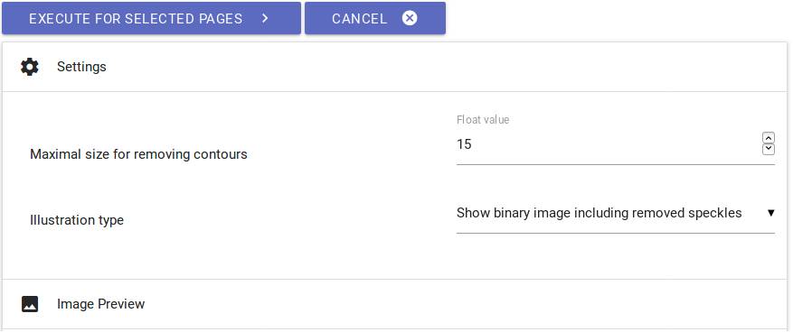
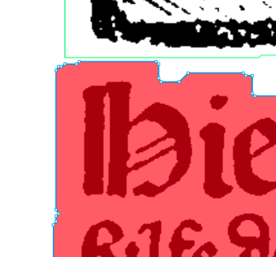
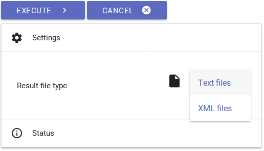

**OCR4all**

Ein Open Source-Tool für einen (semi-)automatischen OCR-Workflow an
historischen Drucken

<u>Anleitung                                                                                  </u>

Version 2.1, September 2019

Um mit Blick auf zukünftige Image-Releases und sonstige technische
Neuerungen immer auf dem aktuellen Stand zu bleiben, bitten wir Sie,
unsere Mailingliste
[<u>OCR4all</u>](https://lists.uni-wuerzburg.de/mailman/listinfo/ocr4all)
zu abonnieren.

# Inhaltsverzeichnis

[Inhaltsverzeichnis 1](#_Toc18669031)

[1. OCR4all 2](#ocr4all)

[1.1 Einführung 2](#einführung)

[1.2 Einrichtung und Ordnerstruktur 3](#einrichtung-und-ordnerstruktur)

[2. Vorbereitung von Scans und Bilddateien (Scantailor)
3](#vorbereitung-von-scans-und-bilddateien-scantailor)

[3. Start und Übersicht 4](#start-und-übersicht)

[3.1 OCR4all starten 4](#ocr4all-starten)

[3.2 Project Overview 4](#project-overview)

[4. Workflow 6](#workflow)

[4.1 Process Flow 6](#process-flow)

[4.2 Preprocessing 8](#preprocessing)

[4.3 Noise Removal 9](#noise-removal)

[4.4 Segmentation – LAREX 9](#segmentation-larex)

[4.4.1 Voreinstellungen 10](#voreinstellungen)

[4.4.2 Übersicht und Werkzeugleiste 10](#übersicht-und-werkzeugleiste)

[4.4.3 Werkbezogene Einstellungen: Regions, Parameters, Reading Order,
Settings
12](#werkbezogene-einstellungen-regions-parameters-reading-order-settings)

[4.4.4 Beispielhafte Segmentierung einer Scanseite
15](#beispielhafte-segmentierung-einer-scanseite)

[4.4.5 Weitere Bearbeitungsoptionen 19](#weitere-bearbeitungsoptionen)

[4.4.6 Abschluss der Segmentierung mit LAREX
22](#abschluss-der-segmentierung-mit-larex)

[4.5 Line Segmentation 22](#line-segmentation)

[4.6 Recognition 23](#recognition)

[4.7 Ground Truth Production 24](#ground-truth-production)

[4.8 Evaluation 25](#evaluation)

[4.9 Training 26](#training)

[4.10 Post Correction 28](#post-correction)

[4.11 Result Generation 29](#result-generation)

[5. Fehler, häufige Probleme und ihre Vermeidung
30](#fehler-häufige-probleme-und-ihre-vermeidung)

# 1. OCR4all

## 1.1 Einführung

OCR4all ist eine Software, die zur digitalen Texterschließung
vornehmlich sehr früh gedruckter Werke entwickelt wurde, deren
aufwendige Drucktypen und oft uneinheitliche Layoutkonzeptionen die
Erkennungsmöglichkeiten vieler anderer Texterkennungsprogramme
übersteigen. Verständlich und selbstständig anwendbar spricht der in
OCR4all vorgeschlagene Workflow unter anderem auch einen dezidiert
nicht-informatisch vorgebildeten Nutzerkreis an und kombiniert
unterschiedliche Arbeitswerkzeuge und Tools innerhalb einer
einheitlichen Benutzeroberfläche. Der ständige Wechsel zwischen
unterschiedlichen Programmen ist auf diese Weise nicht mehr nötig.

Von der Vorverarbeitung der zur bearbeitenden Bilddateien (sog.
Preprocessing) über die Layoutsegmentierung (sog. Region Segmentation
mit LAREX), die Extrahierung der klassifizierten Layoutregionen und
Zeilensegmentierung (Line Segmentation) und Texterkennung (Recognition)
bis hin zur Korrektur der erkannten Texte (Ground Truth Production) und
der Erstellung werkspezifischer OCR-Modelle in einem Trainingsmodul
beschreibt OCR4all einen vollwertigen OCR-Workflow (s. Abb. 1).

*Abb. 1: Hauptkomponenten des OCR4all-Workflows.*

V. a. durch die Möglichkeit der Herstellung und des Trainings
werkspezifischer Texterkennungsmodelle, die sich dann theoretisch immer
auch auf andere Drucke anwenden lassen, können mit OCR4all bei so gut
wie allen gedruckten Texten sehr gute Ergebnisse in der digitalen
Texterschließung erzielt werden.

Mit Blick auf diese Gesamtkonzeption gibt die vorliegende Anleitung
einen ausführlichen und detaillierten Einblick in die Arbeit und
Einsatzmöglichkeiten von OCR4all im Rahmen der OCR besonders früher
Drucke. Während in Kapitel 1 die allgemeine Einrichtung und
Ordnerstruktur erläutert wird, behandelt Kapitel 2 einen empfohlenen
Vorverarbeitungsschritt von Scans und Bilddateien außerhalb von OCR4all,
der zu einer Verbesserung von Ergebnissen und Erleichterung der
Arbeitsschritte innerhalb von OCR4all führt. Kapitel 3 behandelt das
Starten von OCR4all sowie eine Übersicht der grundlegenden Funktionen.
Das daran anschließende Kapitel 4 führt dann detailliert durch die
unterschiedlichen und aufeinander aufbauenden Teilmodule des oben
beschriebenen OCR-Workflows und stellt die eigentliche Bearbeitung von
Drucken und Erstellung von OCR-Texten praktisch vor. Das abschließende
Kapitel 5 widmet sich den aktuell häufigsten Benutzerproblemen.

## 1.2 Einrichtung und Ordnerstruktur

Sobald OCR4all vollständig installiert ist, besteht mit „ocr4all“ und
den beiden Unterordner „data“ und „models“ auch eine grundlegende und
notwendige Ordnerstruktur für die Bearbeitung von Werken.

In „data“ werden dabei sowohl alle Daten gespeichert, die der Nutzer in
OCR4all bearbeiten will, als auch diejenigen automatisch abgelegt, die
während des OCR-Workflows vom Nutzer mittels OCR4all produziert werden.
Dazu muss zu Beginn in „data“ ein sog. Werkordner angelegt werden
(vermeiden Sie in der frei wählbaren Bezeichnung Ihres Werks bitte
Umlaute und Leerzeichen!), der wiederum einen Ordner namens „input“ mit
den zu bearbeitenden Scans bzw. Bilddateien enthält. Im weiteren Verlauf
der Arbeit mit OCR4all werden einem, auf derselben Ebene automatisch
erstelltem „processing“-Ordner jeweils Bilder für unterschiedliche
Verarbeitungsstufen der Scandateien und PageXML-Dateien hinzugefügt.

In „models“ können allgemeine gemischte Modelle zur Texterkennung
abgelegt werden (eine Auswahl findet sich
[<u>hier</u>](https://github.com/OCR4all/ocr4all_models)). Auch werden
hier mit OCR4all erstellte werkspezifische Modelle in einem nach dem
entsprechenden Werk benannten Ordner abgelegt. Sobald der jeweilige
Trainingsprozess beginnt, werden in diesen
„models/*Werkbezeichnung*“-Ordner die so neu entstehenden Modelle
durchnummeriert (d. h. mit dem Modell(-ensemble) „0“ beginnend)
abgespeichert.

# 2. Vorbereitung von Scans und Bilddateien (Scantailor)

Häufig liegen Werke, für die eine OCR durchgeführt werden soll,
lediglich als Faksimilia vor. Deren Einzelbilder weisen zwar meistens
eine gute bis sehr gute Qualität auf, sind jedoch in ihrer Gesamtanlage
für den direkten Import in OCR4all eher ungeeignet. Dies ist bspw. der
Fall, wenn Bilddateien über den eigentlichen Seiteninhalt hinaus Teile
von Buchdeckel oder -rückseite sowie Teile einer Auflagefläche zeigen.
Werden solche Bilder während des Workflows binarisiert, entstehen durch
unterschiedliche Kontraste in den Originalen schwarze Trennlinien, die
neben der eigentlichen OCR v. a. für die Segmentierung problematisch
sind. Auch die Rotation von Scans oder die Darstellung von zwei Seiten
pro Scan stellen häufige Probleme dar.

Diese können jedoch durch eine entsprechende Vorverarbeitung von
Bilddateien einfach vermieden werden: Ziel muss es deshalb sein, Scans
für die Arbeit mit OCR4all zu verwenden, die möglichst nur den zur
Erkennung gedachten Inhalt einer einzelnen Seite zeigen. Gleichzeitig
sollten über den eigentlich relevanten sog. Content hinaus auch diese
vorverarbeiteten Bilder jedoch ausreichend unbedruckte bzw.
unbeschriebene Seitenfläche aufweisen, um bspw. bestimmte
Segmentierungsvorgänge nicht zu verkomplizieren. Sinnvoll ist es also,
genau jene Teile des Bildes zu entfernen, die nicht zur eigentlichen
Druckseite gehören und deshalb nicht erfasst werden müssen, daneben
jedoch so viel der Originaldruckseite wie möglich zu erhalten (d. h.
eben z. B. Seitenränder nicht vollständig zu entfernen).

Dazu bieten sich theoretisch sämtliche Bildbearbeitungsprogramme an.
Empfohlen wird jedoch an dieser Stelle die Arbeit mit Scantailor, da
große Bildmengen einfach und standardisiert in relativ geringer Zeit
verarbeitet werden können. Ausführliches Anleitungs- und Videomaterial
findet sich
[<u>hier</u>](https://github.com/scantailor/scantailor/wiki).

# 3. Start und Übersicht

## 3.1 OCR4all starten

-   **Docker starten**:

    -   Linux: Docker startet automatisch mit Inbetriebnahme des
        Rechners

    -   Docker for Windows: Docker starten über Docker-Icon in
        „Programme“, „Docker is running“ abwarten

    -   Docker Toolbox: Docker Quickstart Terminal öffnen, „Docker is
        configured to use default machine...“ abwarten

-   **OCR4all starten**:

    -   Linux: Terminal öffnen, „docker start -ia ocr4all“ eingeben und
        mit „Enter“ bestätigen, Serverstart abwarten

    -   Windows 10 (Pro, Enterprise, Education): Windows-PowerShell
        öffnen, Befehl „docker start -ia ocr4all“ eingeben, mit „Enter“
        bestätigen, Serverstart abwarten

    -   Ältere Windowsversionen (mit Docker Toolbox): im Docker
        Quickstart Terminal „docker start -ia ocr4all“ eingeben, mit
        „Enter“ bestätigen, Serverstart abwarten

-   Danach kann **OCR4all im Browser** je nach verwendeter
    Docker-Version unter den folgenden Domains aufgerufen werden:

    -   Linux, Docker for Windows, MacOS:
        [<u>http://localhost:1476/OCR4all_Web/</u>](http://localhost:1476/OCR4all_Web/)

    -   Docker Toolbox:
        [<u>http://192.168.99.100:1476/OCR4all_Web/</u>](http://192.168.99.100:1476/OCR4all_Web/)

## 3.2 Project Overview

Wird OCR4all im Browser geöffnet, gelangt der Nutzer automatisch auf die
Startseite „Project Overview“:

-   **„Settings“**: Die Option „Settings“ dient dazu, jenes Werk
    > auszuwählen, das im Folgenden bearbeitet werden soll. Dazu wird
    > unter „Project Selection“ aus einer Dropdown-Liste das gewünschte
    > Werk ausgewählt, welches zuvor als Ordner unter
    > ocr4all/data/*Werktitel* angelegt wurde (s. 1.2). Zusätzlich
    > erfolgt unter „Project image type“ die Auswahl von „Gray“.

> Unter „Project processing mode“ kann zwischen den Modi „Latest“ und
> „Legacy“ ausgewählt werden. Neue Projekte sollten stets mit dem Modus
> „Latest“ geladen werden, dessen Verwendung auch als Grundlage für
> diese Version der Anleitung vorausgesetzt wird. Der „Legacy“-Modus
> unterstützt als Übergangsmodus die Weiterbearbeitung von Projekten aus
> vorhergehenden OCR4all-Versionen, wird jedoch in zukünftigen
> Image-Releases nicht mehr enthalten sein.
>
> Die Notwendigkeit zweier unterschiedlicher Arbeitsmodi ergibt sich aus
> der Tatsache, dass in Zukunft („Latest“) alle während des Workflows
> und für dessen Funktionieren entstehenden Daten in einer einzigen
> PageXML-Datei pro Scanseite gespeichert werden und nicht mehr in Form
> vieler Einzeldateien vorgehalten werden. Um den Nutzern jedoch die
> Fertigstellung ihrer im alten Modus („Legacy“) befindlichen Projekte
> zu ermöglichen, enthält die vorliegende Version von OCR4all die
> Wahlmöglichkeit zwischen beiden Modi.
>
> 

*Abb. 2: Settings im Project Overview.*

-   Nach der Auswahl des Werks erfolgt das Laden des Werks über den
    > Button „LOAD PROJECT“! Da von OCR4all bestimmte, festgelegte
    > Dateibenennungen und -formate verlangt werden (0001.png usw.),
    > kann der LOAD-Funktion die Aufforderung einer Konvertierung
    > folgen. Diese kann direkt in OCR4all vorgenommen werden.

> 
>
> *Abb. 3: Mögliche Datenkonvertierung.*

-   Unter der Option „**Overview“** kann nun jederzeit der tabellarisch
    > geordnete, aktuelle Bearbeitungszustand des geladenen Werks
    > eingesehen werden. Jede Seite des vorliegenden Werks erhält dazu
    > als sog. „Page Identifier“ eine eigene Zeile, die darauffolgenden
    > Spalten bilden von links nach rechts den typischen und
    > vorgeschlagenen OCR4all-Workflow ab. Wurden bestimmte
    > Arbeitsschritte des Gesamtworkflows durchgeführt, werden die
    > entsprechenden Seiten im „Overview“ als bearbeitet (Haken)
    > markiert. Über die Optionen „Show... entries“ und „Search“ können
    > die Anzeige selbst verändert oder besonders umfassende Werke
    > durchsucht werden!

> 

*Abb. 4: Overview.*

-   Durch einen Klick auf einzelne „**Page Identifier“** können die
    > Bearbeitungszustände einzelner Scanseite sowie die zu ihnen
    > bereits vorliegenden Daten über den gesamten Arbeitsprozess hinweg
    > eingesehen werden. Dazu dient die Spalte „Images“ sowie die
    > zugehörigen Optionen „Original“, „Binary“, „Gray“ sowie „Noise
    > Removal“.

# 4. Workflow

OCR4all bietet grundsätzlich zwei unterschiedliche Varianten eines
OCR-Workflows an, die sich v. a. im Hinblick auf den mit ihnen
verbundenen Arbeitsaufwand, damit jedoch fast zwangsläufig auch in
Überprüfbarkeit von Teilergebnissen und somit Qualität der erstellten
Daten stark von einander unterscheiden können. Beide Varianten werden im
Folgenden vorgestellt und eingeordnet.

## 4.1 Process Flow

Die Variante des sog. **„Process Flow“** (Hauptmenü ☰ → Process Flow)
bietet die Möglichkeit eines nahezu vollautomatisierten Workflows. Hier
werden lediglich die zur Bearbeitung vorgesehenen Scans in der rechten
Seitenleiste ausgewählt und mittels Haken danach all jene
Arbeitsschritte ausgewählt, die am vorliegenden Datenmaterial
durchgeführt werden sollen.

*Abb. 5: Teilkomponenten des „Process Flow“.*

Lediglich für das Teilmodul „Recognition“ muss nun noch ein geeignetes
OCR-Modell oder Modellensemble (fünf gleichzeitig und miteinander
agierende Einzelmodelle, s. dazu auch Kap. 4.7) zur Erkennung ausgewählt
werden. Dies geschieht unter „Settings“ → „Recognition” → „General”),
wie in der folgenden Abb. dargestellt, aus der Liste aller verfügbaren
OCR-Modelle („Line recognition models – Available“).

*Abb. 6: Auswahl eines geeigneten OCR-Modells.*

Generell ist es dabei möglich, mehr als nur ein Modell für die Erkennung
auswählen. Empfohlen wird dies jedoch nur dann, wenn auch
unterschiedliche Typen innerhalb des zu erkennenden Drucktextes
vorkommen.

Durch „EXECUTE“ wird der „Process Flow“ gestartet. Über
Fortschrittsbalken zu den einzelnen Teilmodulen lässt sich der aktuelle
Stand der automatisierten Bearbeitung verfolgen. Nach dem vollständigen
Durchlauf des Workflows können die Ergebnisse im Menüpunkt „Ground Truth
Production“ (☰) überprüft werden.

*Abb. 7: Zeilenbilder mit entsprechendem OCR-Ergebnis.*

Entsprechen die erstellten OCR-Texte auf Zeilenbasis der gewünschten
bzw. geforderten Erkennungsgenauigkeit, können bereits jetzt finale
OCR-Ergebnisse (TXT und/oder PageXML) unter dem Menüpunkt „Result
Generation“ (☰) generiert werden. Entsprechen die Ergebnisse nicht der
gewünschten Genauigkeit, können sie vor der Ergebnisausgabe noch einmal
korrigiert werden (s. dazu Kapitel 4.8).

Neben dem sog. „Process Flow“ bietet OCR4all auch die Möglichkeit eines
**sequenziellen Workflows**, bei dem der Nutzer die unterschiedlichen
Teilmodule (s. dazu Abb. 1) und deren zugehörige Arbeitsschritte
eigenständig durchführt, um jeweils die Korrektheit und Qualität der
produzierten Daten zu gewährleisten. Da die separaten Teilmodule
aufeinander aufbauen, erscheint diese Herangehensweise v. a. im Falle
der Bearbeitung frühneuzeitlicher Drucke mit aufwendigem und komplexeren
Layout besonders sinnvoll.

V. a. Erstnutzern wird an dieser Stelle ohnehin geraten, mindestens
einmal den nun folgenden schrittweisen Workflow der OCR durchzuführen,
um die Funktionsweise der jeweiligen Teilmodule zu verstehen.

## 4.2 Preprocessing

**Input:** Originalbild (farbig, in Graustufen oder binär).

**Output:** entzerrtes Binär- (und Graustufen-) Bild.

-   Dieser Bearbeitungsschritt dient der Erstellung von Binär- und
    normalisierten Graustufenbildern, welche die Grundlage für
    erfolgreiche Segmentierung und OCR darstellen.

-   In der rechten Seitenleiste werden alle Scans ausgewählt, die
    bearbeitet werden sollen; alle Einstellungen („Settings (General)“
    und „Settings (Advanced)“) bleiben bestehen, d. h. der Winkel der zu
    bearbeitenden Bilder bleibt unverändert, ebenso die automatisch
    generierte Anzahl der durch das Teilmodul verwendeten CPUs
    (letzteres betrifft alle folgenden Teilmodule von OCR4all!).

*Abb. 8: Einstellungen zum Preprocessing.*

-   Der Binarisierungsvorgang kann durch einen Klick auf „EXECUTE”
    gestartet werden. Der Verlauf des Arbeitsschritts kann in der
    Konsole, genauer dem „Console Output“, verfolgt werden. Ggf. werden
    in „Console Error“ während des Binarisierungsprozesses Warnungen
    ausgegeben. Diese haben jedoch keine Auswirkungen auf das
    Binarisierungsergebnis.

-   Ob die Binarisierung erfolgreich war, kann unter „Project Overview”
    und durch den Klick auf einen beliebigen „Page Identifier” sowie die
    Bildanzeige „Binary” kontrolliert werden. Außerdem sollten in der
    Projektübersicht in der Spalte “Preprocessing” für alle bearbeiteten
    Bilddateien Haken erschienen sein.

## 4.3 Noise Removal

**Input:** verunreinigte Binärbilder.

**Output:** Binärbilder ohne oder mit nur wenigen Verunreinigungen.

-   Mit Hilfe der Option Noise Removal können bspw. kleinere
    Verunreinigungen wie Flecken und Punkte auf den Scans getilgt
    werden.

-   Klicken Sie zur Benutzung im Hauptmenü auf den Arbeitsschritt „Noise
    Removal” und wählen Sie am rechten Bildschirmrand aus, auf welche
    Scans dieser Vorgang angewendet werden soll. Lassen Sie alle
    Defaults zunächst bestehen und betrachten Sie nach der Betätigung
    von „EXECUTE“ probeweise das Ergebnis, in dem Sie auf den Schriftzug
    des jeweiligen Scans in der rechten Seitenleiste klicken, den Sie
    betrachten wollen. Unter „Image Preview” wird Ihnen nun in einer
    Gegenüberstellung das Ergebnis im Vergleich mit dem unbearbeiteten
    Scan angezeigt. Rot eingefärbte Bildelemente wurden durch den
    Arbeitsschritt entfernt.

*Abb. 9: Einstellungen zum Teilmodul Noise Removal.*

-   Sind noch zu viele störende Elemente auf dem Scan zu sehen, setzen
    Sie den Wert der „Maximal size for removing contours” geringfügig
    nach oben, führen den Arbeitsschritt durch einen Klick auf „EXECUTE”
    erneut durch und prüfen wiederum das Ergebnis.

-   Wurden zu viele Bildelemente entfernt, korrigieren Sie den Wert der
    „Maximal size for removing contours” nach unten.

-   Verfahren Sie in dieser Weise weiter, bis Sie mit dem Ergebnis
    zufrieden sind.

## 4.4 Segmentation – LAREX

**Input:** vorverarbeitete Bilder.

**Output:** strukturelle Informationen zu Layoutregionen (Typ und
Position) sowie deren Reading Order.

LAREX dient als Tool der Segmentierung, d. h. zur Strukturierung und
Klassifizierung des Layouts von Druckseiten mit Blick auf weitere
Verarbeitungsschritte. Grundlegend ist dabei die Annahme, dass sich v.
a. die Seiten besonders früher Druckerzeugnisse aus einem immer
wiederkehrenden Pool unterschiedlicher Layoutelemente zusammensetzen,
ihr Aufbau auch werkimmanent also ein bis zu einem bestimmten Grad
einheitlicher ist. Aus diesem Grund stehen dem Benutzer verschiedene
Werkzeuge und Hilfsmittel zur Verfügung, um eine Druckseite so zu
strukturieren, d. h. zu segmentieren, dass alle für die noch folgenden
Bestandteile des Workflows notwendigen, das Seitenlayout betreffenden
Informationen einer Seite adäquat erfasst werden. Dazu gehören neben der
grundlegenden Unterscheidung Text vs. Nicht-Text (also bspw. Text vs.
Bild/Holzschnitt) sowie deren weiterer Spezifizierung (also im Falle des
Textes bspw. Überschrift, Haupttext, Seitenzahl etc.) auch Informationen
zur Reading Order, d. h. der Lese- und Nutzungsreihenfolge der
vorhandenen Layoutelemente

### <u>4.4.1 Voreinstellungen</u>

-   Menü: „Segmentation“ → „LAREX“

-   „Segmentation image type“: „Binary“, falls mit den binarisierten
    Bilddateien weitergearbeitet werden soll; „Despeckled“, falls zuvor
    der Arbeitsschritt „Noise Removal“ vollzogen wurde

-   „OPEN LAREX“ → LAREX öffnet sich in einem neuen Tab.

*Abb. 10: LAREX-Einstellungen.*

Mittig wird nun die erste der ausgewählten Scanseiten angezeigt. Es sind
bereits erste Segmentierungsergebnisse zu sehen. Diese entstehen
aufgrund einer automatischen Segmentierung einer jeden Scanseite, sobald
diese das erste Mal aufgerufen wird. Gespeichert sind diese Ergebnisse
nicht. Aufgabe des Users ist es im Folgenden, Einstellungen vorzunehmen,
um die angezeigten automatischen Segmentierungsergebnisse an das Layout
des vorliegenden Werks anzupassen bzw. händische Nachkorrekturen dieser
Ergebnisse vorzunehmen, um ein korrektes Segmentierungsergebnis zu
erhalten.

*Abb. 11: Startanzeige und automatische Segmentierungsergebnisse.*

### <u>4.4.2 Übersicht und Werkzeugleiste</u>

In der linken Seitenleiste werden alle zu segmentierenden und zuvor
ausgewählten Scans angezeigt. Je nach aktuellem Bearbeitungsstatus
erhalten sich unterschiedliche, farbige Markierungen in der rechten
unteren Ecke:

-   Ausrufezeichen, orange: „There is no segmentation for this page.“ –
    Aktuell liegen keine Segmentierungsergebnisse für diese Scanseite
    vor.

-   Warndreieck, orange: „Current segmentation may be unsaved.“ – Die
    aktuellen Segmentierungsergebnisse sind noch nicht gespeichert (s.
    u.).

-   Diskette, grün: „Segmentation was saved in this session.“ – Für die
    Scanseite liegen die Segmentierungsergebnisse, gespeichert als
    XML-Dateien, vor.

-   Schloss, grün: „There is a segmentation for this page on the
    server.“ – Die einzelnen, gespeicherten Segmentierungsergebnisse
    wurden nach Abschluss der Segmentierung des Gesamtwerks als korrekt
    bestätigt (s. u.).

*Abb. 12: Verschiedene Bearbeitungsstatus.*

In der Kopfleiste finden sich verschiedene Werkzeuge und Werkzeuggruppen
zur Navigation und Bearbeitung:

*Abb. 13: Verschiedene Menüpunkte der Werkzeugleiste.*

-   
    **Open a different book**: Für die in OCR4all eingebundene Version
    von LAREX sind hier keine Einstellungen oder Veränderungen
    notwendig!

-   **Image Zoom**: Über die hier möglichen Einstellungen wird die
    allgemeine Darstellung von Scanseiten und Bilddateien in LAREX
    geregelt, d. h. z. B. Zoomeinstellungen. Allerdings können diese
    Einstellungen und Darstellungsoptionen auch mithilfe der Maus
    und/oder des Touchpads geregelt werden (einfaches Verschieben der
    angezeigten Seite durch gehaltenen Linksklick auf den Scan und
    Bewegung der Maus; Zoom über Mausrädchen oder Zoomeinstellungen des
    Touchpads).

-   **Undo**
    und
    
    **Redo**: Zurücknehmen oder Wiederholen der letzten Benutzeraktion.

-   
    **Delete selected items**: Entfernt die aktuell ausgewählten
    Regionen.

-   **RoI, Region, Segment, Order**: Hier werden, ergänzt durch die
    rechte Seitenleiste, die verschiedenen Möglichkeiten der
    Scanbearbeitung und Segmentierung aufgezeigt. Während die in der
    Werkzeugleiste aufgeführten Optionen im Allgemeinen einer
    spezifischen Bearbeitung der aktuell vorliegenden Scanseite dienen
    (s. u.), werden dagegen in der rechten Seitenleiste v. a.
    scanübergreifende und werkbezogene Optionen angezeigt.

*Abb. 14: Einstellungen der rechten Seitenleiste.*

Auch sie können jedoch jederzeit ergänzt, verändert und angepasst
werden. Hilfreich und sinnvoll ist es in diesem Fall, alle vorgenommenen
Einstellungen hinsichtlich der Erkennungsparameter („Parameters“) sowie
der in einem Werk vorhandenen und vom User festgelegten Layoutelemente
(„Regions“) jederzeit unter „Settings“ zu speichern und bei der nächsten
Verwendung des Tools wiederzuverwenden. Dies ermöglicht die Arbeit mit
werkspezifischen Einstellungen.

### <u>4.4.3 Werkbezogene Einstellungen: Regions, Parameters, Reading Order, Settings</u>

-   **„Regions“**: Jede Scan- und damit Werk- und Textseite besteht
    entsprechend der Konzeption und Idee von LAREX aus unterschiedlichen
    Layoutelementen. Darunter fallen z. B. der Haupttext, Überschriften,
    Marginalien, Seitenzahlen usw. Jedem dieser Layoutelemente muss in
    LAREX eine bestimmte, definierte „region“ bzw. Layoutregion
    zugeordnet werden. Diese Zuordnung wird mit Blick auf weitere
    Bearbeitungsschritte und die eigentliche Erkennung des dargestellten
    Inhalts konsistent über das gesamte zu segmentierende Werk erfolgen!
    Neben einigen vordefinierten und festgelegten Layoutregionen wie
    „image“ (z. B. graphische Darstellungen wie Holzschnitte,
    Zierinitialen usw.), „paragraph“ (Haupttext) oder „page_number“
    (Seitenzahl) können durch den User weitere, werkspezifische
    Layoutregionen unter „Create“ hinzugefügt und definiert werden, d.
    h. neben einer Darstellungsfarbe kann unter „minSize“ auch die
    Mindestgröße einer als entsprechende Layoutregion zu erkennenden
    Text- oder Bildregion auf der Scanseite festgelegt werden. Mithilfe
    des „SAVE“-Buttons wird die so definierte Layoutregion der
    werkspezifischen Liste hinzugefügt.

*Abb. 15: Einstellungsoptionen unter Regions.*

-   Zusätzlich bietet „Regions“ die Möglichkeit, bestimmten
    Layoutregionen einen festen und vordefinierten Platz auf einer
    Scanseite zuzuweisen, der bei der automatischen Segmentierung der
    nachfolgenden Seiten (beim ersten Öffnen dieser) übernommen wird, d.
    h.: Wiederholt sich das Layout einer Seite über ein Werk hinweg
    immer wieder, so kann hier eine Art der Layoutschablone erzeugt
    werden, mit deren Hilfe die automatische Segmentierung verbessert
    und damit die Anzahl der korrigierenden Eingriffe durch den User im
    Folgenden potentiell verringert wird. Um die Lage der Layoutregionen
    an das Layout der Seiten innerhalb des Werkes anzupassen, kann die
    aktuelle Lage der Layoutregionen angezeigt und danach durch
    einfaches Auswählen der Regionen auf der Scanseite verändert werden.

*Abb. 16: Anzeige von Layoutregionen und Layoutschablone.*

Wird durch den User eine neue „region“ definiert, so kann die Lage
dieser über die Werkzeugleiste und die nachfolgende Option „Region“ →
„Create a region rectangle (Shortcut: 1)“ festgelegt und auch danach
jederzeit verändert werden. Für „images“ kann keine Layoutregion auf der
Scanseite verortet werden.

*Abb. 17: Einrichtung neuer Layoutregionen.*

Gleichzeitig ist es darüber hinaus nicht immer sinnvoll, für alle
Layoutregionen fixe Plätze über das gesamte Werk auf Scanseiten
festzulegen. V. a. wenn die Lage bestimmter „regions“ wie Überschriften,
Motti, aber auch Seitenzahlen oder Bogensignaturen immer wieder
variiert, kann es durch die Festlegung definierter Plätze zu
Fehlerkennungen kommen. Sinnvoller ist es in diesem Fall, entsprechende
Layoutelemente nach der automatischen Segmentierung händisch zu
korrigieren. Soll die Lage von Layoutregionen ganz gelöscht werden, wird
sie einfach mithilfe eines Klicks ausgewählt und über „Entf“ gelöscht.

-   **„Parameters“**: Hier werden allgemeine Parameter der Text- und
    Bilderkennung festgelegt. Die Notwendigkeit der Einstellung
    werkspezifischer Parameter erklärt sich aus dem sehr uneinheitlichen
    Layout und Druckbild v. a. frühneuzeitlicher Drucke. So können hier
    Wörter und auch ganze Zeilen in unterschiedlichen Abständen
    zueinander gedruckt sein. Um bspw. zu vermeiden, dass diese als
    eigene Layoutregionen und nicht zugehörig zu einem zusammenhängenden
    Textabschnitt erkannt werden, kann unter „Text Dilation“ die
    Ausdehnung einer als Text erkannten Region in X- und Y-Richtung
    definiert werden. Auf diese Weise können Zeilen- und Wortabstände
    überwunden und weitständige Textabschnitte miteinander verschmolzen
    werden. Es empfiehlt sich hier, werkspezifisch unterschiedliche
    Einstellungen zu testen, um diese zu optimieren.

*Abb. 18: Einstellungen in Parameters.*

-   **„Settings“**: Unter dem Menüpunkt „Settings“ können die unter
    „Regions“ und „Parameters“ festgelegten Segmentierungs- und
    Darstellungsoptionen gespeichert und bei Bedarf, z. B. bei der
    Wiederaufnahme der Segmentierung eines Werks nach einer
    Unterbrechung, wieder geladen werden. Dazu dienen die Buttons „SAVE
    SETTINGS“ und „LOAD SETTINGS“. Im Falle des Speicherns wird eine
    XML-Datei erzeugt, die beim Laden wieder ausgewählt werden muss (auf
    „Load Settings“ klicken, in sich öffnendem Fenster entsprechende
    Datei auswählen und öffnen). Zusätzlich gibt es hier ebenfalls die
    Möglichkeit, sich Segmentierungsergebnisse bereits gespeicherter
    Seiten noch einmal laden und damit anzeigen zu lassen. Dazu wird
    unter „Advanced Settings“ auf „LOAD NOW“ geklickt. Falls für die
    vorliegende Scanseite einmal eine XML-Datei mit
    Segmentierungsergebnissen gespeichert wurde, wird diese nun geladen.
    Gleichzeitig kann diese letzte Option automatisiert ab dem Start von
    LAREX realisiert sein, sofern bereits entsprechende
    Segmentierungsergebnisse vorliegen.

*Abb. 19: Settings.*

-   **„Reading Order“**: Soll in den sich der Segmentierung
    anschließenden und im weiteren Verlauf erstellbaren
    Erkennungsergebnissen der Text einer Seite in der richtigen
    Reihenfolge wiedergegeben werden, so ist die Festlegung einer
    Reading Order derjenigen Layoutelemente unerlässlich, die Text
    enthalten. Diese Festlegung kann, bspw. bei klarem und einfachem
    Druckbild, automatisiert erfolgen. Bei komplexeren Layoutstrukturen
    empfiehlt es sich dagegen, die Reading Order manuell festzulegen, um
    Fehler in der Reihenfolge zu vermeiden.

Dazu wird in der Werkzeugleiste in der Gruppe „Order“ zwischen den
Werkzeugen „Auto generate a reading order“ und „Set a reading order“
ausgewählt.

*Abb. 20: Rechts: Reading Order in der Werkzeugleiste*

Erfolgt ein Klick auf die automatisierte Erstellung der Reading Order,
erscheint in der rechten Seitenleiste unter „Reading Order“ eine naive
Auflistung aller Text beinhaltenden Layoutelemente von oben nach unten.
Wird die Reihenfolge manuell festgelegt, müssen die einzelnen Elemente
auf der Scanseite in der richtigen Reihenfolge durch den User angeklickt
werden, um in der erwähnten Auflistung zu erscheinen (s. u.). Die
einzelnen Elemente der Reading Order können mittels Drag-and-Drop in
ihrer Reihenfolge verändert werden und einzelne Elemente über das
zugehörige Mülleimer-Icon entfernt werden. Auch die Reading Order kann,
wie alle anderen Eingriffe in LAREX, vor dem finalen Abspeichern der
Segmentierungsergebnisse immer wieder geändert werden.

### <u>4.4.4 Beispielhafte Segmentierung einer Scanseite</u>

LAREX erstellt mit dem Laden einer Scanseite automatisch erste
Segmentierungsergebnisse. Diese müssen im Folgenden korrigiert werden.

Der folgende Segmentierungsdurchgang bezieht sich auf die vierte Seite
des Standardwerkes „Cirurgia“, welches beim Download der
OCR4all-Ordnerstruktur
[<u>hier</u>](https://github.com/OCR4all/getting_started/tree/master/ocr4all/data)
gedownloadet werden kann.

**Fehleranalyse:** Welche Layoutelemente wurden richtig erkannt, welche
fehlerhaft, welche gar nicht? Befinden sich auf den Seitenrändern
Benutzerspuren, Bordüren, Verschmutzungen oder Textteile, die nicht
erkannt werden sollen, das Segmentierungsergebnis jedoch beeinflussen?

*Abb. 21: Automatisches Segmentierungsergebnis für die vierte Seite aus
„Cirurgia“.*

**„Region of Interest“ (RoI)**: Befinden sich außerhalb der Abschnitte
eine Scanseite, die für die Erkennung relevant sind, Elemente, die das
Segmentierungsergebnis negativ beeinflussen (z. B. Benutzerspuren,
Verunreinigungen, Bibliotheksstempel etc.), so kann eine RoI festgelegt
werden, um diese Bereiche von Vornherein aus der automatischen
Segmentierung auszuschließen. Dazu wird in der Werkzeugleiste unter
„RoI“ die Option „Set the Region of Interest“ ausgewählt und mithilfe
der linken Maustaste ein Rechteck um den zu segmentierenden Inhalt der
Scanseite gelegt.

*Abb. 22: Festlegungen einer Region of Interest.*

Ist die RoI festgelegt, erfolgt ein Klick auf das auf der rechten Seite
befindliche Feld „SEGMENT“ – Elemente, die sich außerhalb der RoI
befinden, werden nun nicht mehr berücksichtigt. Wichtig: Wird eine RoI
gesetzt, überträgt sich diese auch auf alle Scanseiten, die im weiteren
Verlauf der Arbeit an einem Werk aufgerufen werden. Da sich die
segmentierungsrelevanten Abschnitte auf einer Seite aufgrund
unterschiedlicher Faktoren immer wieder verschieben können, ist es
wahrscheinlich, auch die RoI in Abständen immer wieder den
Seitengegebenheiten anpassen zu müssen. Dazu können einfach einzelne
Bereiche der RoI angeklickt und mit Hilfe der Maus verschoben werden.

Unabhängig von der RoI kann durch die Option „Create a ignore rectangle“
eine sog. Ignore-Region erstellt werden, mit deren Hilfe kleinräumigere
Scanbestandteile ignoriert und somit von der Segmentierung
ausgeschlossen werden können.

**Korrektur fehlerhaft erkannter Layoutelemente**:

Falsch erkannte Layoutelemente können in ihrer Typisierung geändert
werden. Dazu klickt man mit der rechten Maustaste auf das entsprechende
Element – im sich öffnenden Auswahlfenster kann die korrekte Region
ausgewählt werden.

*Abb. 23: Korrektur einer fehlerhaften Typisierung.*

Soll die Überschrift aufgrund ihrer Verwachsung mit dem ihr folgenden
Text von diesem abgetrennt werden, so kann dies auf drei Arten erfolgen:

Zum einen bietet sich die Möglichkeit, um die zu klassifizierende Region
ein Rechteck zu ziehen. Dazu wird in der Werkzeugleiste unter „Segment“
die Option „Create a fixed segment rectangle“ (Shortcut: 3) ausgewählt,
anschließend mithilfe der Maus ein Fenster um die entsprechende Region
gezogen und im sich darauf öffnenden Auswahlmenü die richtige Benennung
ausgewählt. Zum zweiten kann die Auswahl der zu klassifizierenden Region
mit Hilfe eines Polygons vorgenommen werden. Dies bietet sich vor allem
bei komplexen, unübersichtlichen oder verschachtelten Layouts an, in
denen schräge Kanten, Rundungen in Bildern und Holzschnitten oder im
Textblock platzierte Zierinitialen o. Ä. vorkommen. Hierzu wird in der
Werkzeugleiste unter „Segment“ diesmal die Option „Create a fixed
segment polygon“ (Shortcut: 4) ausgewählt und die zu klassifizierende
Layoutregion in einer Punktlinie eingefasst, deren Ende mit dem Beginn
verknüpft und damit zu einem Polygon zusammengefasst wird. Auch hier
erscheint nach Verbindung von Anfangs- und Endpunkt ein Auswahlmenü, in
dem die richtige Benennung ausgewählt werden kann.

Die dritte Möglichkeit umfasst die Zerteilung des als *paragraph*
erkannten Textblockes aus Überschrift und Haupttext mithilfe einer
Schnittlinie. Diese wird in der Werkzeugleiste unter „Segment“ mit der
Option „Create a cut line“ (Shortcut: 5) ausgewählt.

*Abb. 24: Auswahl der Schnittlinie in der Werkzeugleiste.*

Mit Hilfe der linken Maustaste wird die Linie polygonartig durch mehrere
Klicks quer durch das aufzuspaltende Layoutelement gezogen. Durch einen
Doppelklick auf die linke Maustaste kann ein Endpunkt der Linie gesetzt
wird.

*Abb. 25: Festlegung der Schnittlinie zwischen zwei zu trennenden
Bereichen eines Layoutelements.*

Wird nun auf „SEGMENT“ geklickt, wird der als ein Layoutelement erkannte
Bereich in zwei unterschiedliche Layoutelemente aufgetrennt.
Anschließend kann der Bereich der Überschrift mittels Rechtsklick und
entsprechender Auswahl (s. o.) korrekt umbenannt werden.

*Abb. 26: Korrekte Typisierung der getrennten Bereiche.*

Sollen Layoutelemente, falsch gezogene Schnittlinien, verzogene Polygone
etc. gelöscht werden, können diese einfach durch einen Linksklick der
Maus markiert und anschließend über „Entf“ oder in der Werkzeugleiste
mittels „Delete selected items“ gelöscht werden.

**Festlegung der „Reading Order“** (s. o.):

*Abb. 27: Festlegung der Reading Order.*

**Speichern des Segmentierungsergebnisses des aktuellen Scans:** Das
Speichern der Ergebnisse erfolgt durch einen Klick auf den „SAVE
RESULT“-Button oder durch Strg + S. In diesem Moment wird in der
OCR4all-Ordnerstruktur eine XML-Datei mit den Segmentierungsergebnissen
abgelegt.

*Abb. 28: Speichern von Segmentierungsergebnissen.*

**Anschließend kann in der linken Seitenleiste der nächste Scan
ausgewählt werden**. Soll die Segmentierung eines Scans nachträglich
noch einmal geändert werden, so muss danach einfach die neue
Segmentierung einmal abgespeichert werden – auf diese Weise wird die
dann veraltete XML-Datei durch die aktuelle und neue überschrieben.

### <u>4.4.5 Weitere Bearbeitungsoptionen</u>

Darüber hinaus bestehen generell **weitere Bearbeitungsmöglichkeiten**
von Scans, die im Folgenden angezeigt werden sollen:

-   Für Löschungen oder die Zusammenführung mehrere Layoutelemente zu
    einer zusammenhängenden Region ist es praktisch, diese
    **gleichzeitig auswählen** zu können. Dazu halten Sie die
    Umschalttaste gedrückt und ziehen mit Hilfe der Maus ein Rechteck um
    die entsprechenden Layoutregionen. Die Regionen müssen sich dazu
    vollständig innerhalb des Rechtecks befinden. Alle auf diese Weise
    ausgewählten Layoutregionen erscheinen nun blau umrandet.

-   **„Select contours to combine (with „C“) to segments (see function
    combine)“** (Shortcut: 6): Dieses Werkzeug kann verwendet werden, um
    auch auf sehr eng und detailreich bedruckten Seiten zu einem
    optimalen Segmentierungsergebnis zu gelangen. Grundlegende Idee ist,
    dass Layoutelemente durch die Konturen der einzelnen Typen des
    Textes, den sie beinhalten, oder exakt durch die Ränder von Bildern
    und Zierinitialen begrenzt werden – ohne überschüssigen, durch
    händisches Segmentieren entstehenden Rand, der immer wieder zur
    Elementüberschneidungen und damit zu Ungenauigkeiten mit Folgen für
    die OCR führen kann.

> Um die Funktion auszuführen, erfolgt zuerst ein Klick auf den
> entsprechenden Button in der Werkzeugleiste oder der Shortcut 6.
> Daraufhin werden alle als Layoutelemente der Seite erkannten
> Bestandteile blau eingefärbt.

*Abb. 29: Konturenanzeige.*

> Klickt man nun auf nur einzelne Typen oder sogar Typenbestandteile,
> verfärben sie sich violett – sie sind nun ausgewählt.

*Abb. 30: Konturenauswahl.*

> Es können auch mehrere Typen, ganze Wörter und Zeilen oder Teile
> ganzer Layoutelemente ausgewählt werden (s. o.: Umschalt + Auswahl
> über Aufziehen eines Rechtecks). Erfolgt nach der Auswahl bestimmter
> Typen, Wörter, Zeilen etc. der Shortcut C, so werden alle ausgewählten
> Elemente der Scanseite zu einem eigenen Layoutelement zusammengefasst,
> unabhängig von ihrer vorherigen Elementzugehörigkeit. Die Eingrenzung
> des so entstehenden neuen Layoutelements ist dabei im Vergleich zu den
> automatisch erkannten Elementen sehr viel feiner, weil sie sich wie
> besprochen direkt an den Rändern einzelner Typen oder Bilder
> orientiert. Auf diese Weise ist eine sehr viel detailliertere
> Segmentierung als über die standardisierten Tools möglich.

*Abb. 31: Zusammenfassung ausgewählter Konturen zu einem neuen
Layoutelement.*

> Der anschließende Klick auf „SEGMENT“ fixiert den Eingriff.
> Abschließend kann das entstandene, eigenständige Layoutelement
> entsprechend obigen Vorgehens nach belieben umbenannt werden.

*Abb. 32: Typisierung des segmentierten Layoutelements.*

-   **„Combine selected segments or contours“** (Shortcut: C): Um
    mehrere, einzeln erkannte Layoutelemente zu einer einzigen
    zusammenzufassen, wählen sie die gewünschten Regionen vollständig
    aus (s. o.) und klicken „C“ bzw. auf den entsprechenden Button in
    der Werkzeugleiste.

-   **„Fix/unfix segments, for it to persist a new auto segmentation“**
    (Shortcut: F): Mit Hilfe dieser Funktion können Layoutelemente über
    einen weiteren Segmentierungsvorgang einer Seite hinaus fixiert
    werden. Dazu wird das entsprechende Layoutelement durch Anklicken
    markiert, danach folgt ein Klick auf „F“ oder den entsprechenden
    Button. Fixierte Elemente erscheinend mit einer gestrichelten
    Umrandung. Um die Fixierung zu verwerfen, wird der Vorgang einfach
    wiederholt.

-   **Zoomen**: Mithilfe des Mausrädchens kann bei sehr klein gedrucktem
    Text oder kompliziertem Layout an den Scan herangezoomt werden.
    Mithilfe der Leertaste wird die Anzeige in ihrem ursprünglichen
    Zustand zurückgesetzt.

-   Bei besonders kleinteiligem und damit aufwendigem Layout können
    Segmentierungsergebnisse durch spezielle **Detaileingriffe** weiter
    optimiert werden. Die Umrisse der als Layoutelemente erkannten
    Bereiche einer Scanseite werden bei genauerem Hinsehen als
    Punktlinie dargestellt.

*Abb. 33: Punktlinie als Umriss von Layoutelementen.*

> Diese Punkte können einzeln oder auch zu mehreren verschoben werden,
> um bspw. bei sehr engem Druckbild Überschneidungen mit anderen,
> angrenzenden Layoutelemente zu vermeiden. Einzelne Punkte können durch
> einen gehaltenen Linksklick mit der Maus verschoben werden. Durch
> einen Klick auf die Linie können darüber hinaus bei Bedarf neue Punkte
> geschaffen werden. Auch das Löschen von Punkten ist mithilfe von
> „Entf“ möglich.

-   **„LOAD RESULTS“**: Mit Hilfe dieser Funktion können bereits
    bestehende Segmentierungsergebnisse für eine bestimmte Scanseite
    direkt aus der Ordnerstruktur von OCR4all in LAREX geladen werden.

### <u>4.4.6 Abschluss der Segmentierung mit LAREX</u>

-   Sind alle Segmentierungsarbeiten für ein Werk in LAREX
    abgeschlossen, d. h. wurden für jede Seite eines Werks Ergebnisse
    abgespeichert, so liegen diese nun in der bekannten Ordnerstruktur
    von OCR4all vor.

-   Ob die Segmentierung und Speicherung der Ergebnisse erfolgreich war,
    kann danach abschließend im Menüpunkt „Post Correction“ in der
    Spalte „SEGMENTS“ kontrolliert werden (s. u.).

## 4.5 Line Segmentation

**Input:** vorverarbeitete Bilder und Segmentierungsinformationen in
Form von PageXML-Dateien.

**Output:** extrahierte Textzeilen in den PageXML-Dateien.

-   In direkter Vorbereitung auf die folgende OCR werden in diesem
    Arbeitsschritt alle mittels LAREX festgelegten und klassifizierten
    Layoutelemente in denen Text enthalten ist, in Zeilen zerschnitten
    (die OCR funktioniert zeilenbasiert) und im zugehörigen PageXML
    abgelegt.

*Abb. 34: Einstellungen zur Line Segmentation.*

-   Generell können auch hier die vorhandenen Einstellungen beibehalten
    werden. **Wichtige Einschränkung mit Blick auf das vorhandene
    Seitenlayout**: Liegt ein zwei- oder mehrspaltiges Seitenlayout vor
    und wurden die entsprechenden Textspalten in LAREX jeweils als
    eigenständige Haupttexte segmentiert, muss bei „Maximum # of
    whitespace column separators” der voreingestellte Wert von -1
    (Bestätigung, dass kein mehrspaltiges Layout vorhanden und eine
    Spaltentrennung deshalb nicht erwünscht ist) wie folgt geändert
    werden:

    -   Zur Erklärung: „Whitespace column separators” sind spaltenweise
        gesehen die weißen Randbereiche um Textblöcke.

    -   Bei einem **zweispaltigen Layout**, dessen Text inhaltlich
        fortlaufend ist, d. h. die jeweils ersten Zeilen der beiden
        Textblöcke keine inhaltliche Einheit bilden, muss der Wert bei
        „Maximum # of whitespace column separators” auf **3** gesetzt
        werden: Diese Angabe ergibt sich aus dem linken whitespace der
        linken Textspalte, dem rechten whitespace der rechten Textspalte
        sowie dem gemeinsamen whitespace zwischen beiden Textspalten.

    -   Bei einem **dreispaltigen Layout** müsste der Wert entsprechend
        auf **4** verändert werden usw.

<!-- -->

-   Sobald alle Einstellungen wie gewünscht getroffen sind, klicken Sie
    auf „EXECUTE” und überprüfen die Ergebnisse abermals unter „Project
    Overview”. Hier erhalten die einzelnen Zeilen als Unterpunkte der
    einzelnen Layoutelemente (s. o.).

-   Vor allem bei der Line Segmentation ist immer wieder die Anwendung
    der erweiterten Einstellungen („Settings (Advanced)”) hilfreich – v.
    a. dann, wenn in der Konsole Fehlermeldungen angezeigt werden und
    die Zeilensegmentierung entsprechend nicht fehlerfrei durchgeführt
    werden konnte. Beispielsweise wird bei zu kleinen Buchstaben häufig
    die in den Defaults festgehaltene Minimalbreite von ganzen Zeilen
    unterschritten. Diese Minimalbreite kann jedoch bspw. durch die
    Herabsetzung des Wertes „Minimum scale permitted” unter dem
    Menüpunkt „Limits” geändert werden. Die wiederholte Durchführung der
    Line Segmentation für die ausgewählten Scanseiten wird dann ohne
    Fehlermeldung korrekt vollzogen.

-   Überprüfbar ist die korrekte Zeilensegmentierung auch unter dem
    Menüpunkt „Post Correction” im Reiter „Lines“ (s. u.).

## 4.6 Recognition

**Input:** Textzeilen und ein oder mehrere OCR-Modelle.

**Output:** OCR-Output in Textform für jede in den PageXML-Dateien
vorliegenden Zeile.

-   Der Arbeitsschritt der Recognition stellt die Erkennung von Text auf
    Grundlage der während der Line Segmentation (s. o.) erstellten
    Zeilenbilder aller Layoutelemente mit Text dar.

-   Wählen Sie dazu den Menüpunkt „Recognition”. In der rechten
    Seitenleiste finden Sie nun nur Scans bzw. Druckseiten des
    bearbeiteten Werkes aufgelistet, für die bereits alle Vorbedingungen
    der OCR erfüllt, d. h. alle bisher beschriebenen Arbeitsschritte
    (mit Ausnahme der „Noise Removal“) durchgeführt wurden. Wählen Sie
    jene aus, für die Sie Text produzieren lassen wollen.

-   Wählen Sie nun unter „Line recognition models” in der Spalte
    „Available” all jene Modelle oder Modellensembles aus, die zur
    Erkennung ihres Textes entsprechend der vorhandenen Schriftarten und
    Typen (z. B. frühneuzeitliche bzw. historische Fraktur, Kursive,
    historische Antiqua etc.) geeignet sind. **Die Verwendung von
    Modellensembles** (fünf gleichzeitig und gemeinsam agierende
    Einzelmodelle) **statt einfacher Einzelmodelle wird dringend
    empfohlen!** Durch einfaches Anklicken werden sie in die Spalte
    „Selected” verschoben. Über die „Search“-Funktion ist eine Filterung
    nach Namen möglich, wenn besonders viele Modelle zur Auswahl stehen.

*Abb. 35: Auswahl eines gemischten Modellensembles für die
Texterkennung.*

-   Eine Anpassung der erweiterten Einstellung ist in aller Regel nicht
    notwendig.

-   Klicken Sie nun auf „EXECUTE” und warten Sie die Texterkennung über
    die Fortschrittsanzeige und die Konsole ab.

-   Ist die Erkennung abgeschlossen, können Sie die Ergebnisse für jedes
    Zeilenbild unter dem Menüpunkt „Ground Truth Production” einsehen.

## 4.7 Ground Truth Production

**Input:** Zeilenbild und entsprechender OCR-Output, wenn verfügbar.

**Output:** zeilenbasierte Ground Truth.

-   Unter dem Menüpunkt „Ground Truth Production” können die im
    Teilmodul Recognition erzeugten Texte eingesehen, korrigiert und als
    Trainingsgrundlage in Form von sog. Ground Truth abgespeichert
    werden.

-   Das zugrundeliegende Korrekturtool ist dreispaltig aufgebaut: Auf
    der linken Seite finden sich, jeweils untereinander, die
    auswählbaren Seiten. Mittig werden die durch den Workflow erzeugten
    Zeilenbilder aus den Textseiten (s. o.) sowie die aus ihnen
    generierten Zeilen OCR-Text angezeigt. Diese standardmäßig
    dargestellte Anzeige wird als „Text View“ bezeichnet.

*Abb. 36: Ground Truth Production mit „Text View”.*

Über die Option „Switch to Page View” in der Werkzeugleiste, besteht die
Möglichkeit von der „Text View“ auf die „Page View“ zu wechseln. In
dieser Ansicht können die einzelnen Textzeilen im visuellen
Gesamtkontext des Seitenlayouts bearbeitet werden. Nutzen Sie die Option
„Switch to Text View“ um wieder auf die „Text View“ umzuschalten.

*Abb. 37: Ground Truth Production mit „Page View”.*

Auf der rechten Seite der Anzeige befindet sich das sog. Virtual
Keyboard, in welchem Sonderzeichen (Ligaturen, Abkürzungen, Diakritika
etc.) aufgeführt werden. Diese können durch einfaches Anklicken
entsprechend der Position des Cursors in die Textzeilen auf der linken
Seite eingefügt werden. Um Zeichen zum Keyboard hinzuzufügen, wird
einfach das Plus-Icon betätigt und das entsprechende Zeichen mittels
Copy und Paste in das sich öffnende Formular eingegeben und durch
Betätigung der „Save“-Schaltfläche bestätigt. Sollen Zeichen aus dem
Keyboard gelöscht werden, zieht man diese lediglich mit der Maus auf das
Mülleimer-Icon der Delete-Option. Sind alle gewünschten Veränderungen
vorgenommen, wird das Keyboard durch einen Klick auf „Save” gespeichert
und danach mittels „Lock” gesperrt. Mithilfe der Optionen „Load” und
„Save” können werkspezifische Keyboards im System abgespeichert und
jederzeit neu geladen werden – bspw., wenn man seine Textkorrekturen
unterbricht oder sich das Keyboard auch für die Arbeit mit einem anderen
Werk eignet.

-   Um einzelne Zeilen bei fehlerhafter Erkennung innerhalb der „Text
    View“ zu korrigieren, klicken Sie in die entsprechende Zeile hinein.
    Die daraufhin vertikal zentrierte Zeile kann nun bearbeitet werden.
    Befinden Sie sich innerhalb der „Page View“, so kann der zugehörige
    Zeilentext per Linksklick auf die entsprechende Zeile angezeigt
    werden. Im nun geöffneten Textfeld können ebenfalls Änderungen am
    Zeilentext vorgenommen werden. Um die jeweils nächste Zeile
    anzuwählen, betätigen Sie die „Tabulator“-Taste. Die weiteren
    Arbeitsschritte sind innerhalb beider Anzeigen äquivalent. Haben sie
    alle Eingriffe vorgenommen und liegt damit eine entsprechend
    fehlerfreie Zeile vor, betätigen Sie die „Enter“-Taste. Die soeben
    bearbeitete Zeile färbt sich grün, d. h.: Diese Zeile wird nach dem
    Speichern der bearbeiteten Seite über die Schaltfläche „SAVE RESULT“
    (Shortcut: Strg+S) innerhalb von OCR4all nun automatisch als Ground
    Truth abgespeichert. Sie kann nun mit allen weiteren korrigierten
    Zeilen als Trainingsgrundlage werkspezifischer Modelle sowie zur
    Evaluation der genutzten OCR-Modelle dienen oder wird Ihnen bei der
    Generierung Ihrer Endergebnisse (s. u.) automatisch mit ausgegeben.

-   Wird während der Korrektur eines Werks mittels der Ground Truth
    Production durch den Benutzer festgestellt, dass der Grad der
    Erkennung durch gemischte Modelle aufgrund unterschiedlicher
    Faktoren noch nicht ausreicht, um eine manuelle, abschließende
    Textkorrektur ohne zu großen zeitlichen Aufwand durchzuführen, so
    bietet OCR4all die Option des Trainings werkspezifischer Modelle.
    Diese haben werkspezifisch im Allgemeinen höhere Erkennungsraten als
    gemischte Modelle.

## 4.8 Evaluation

**Input:** zeilenbasierte OCR-Texte und entsprechende Ground Truth.

**Output:** Fehlerstatistiken.

-   Der Menüpunkt Evaluation dient der Ermittlung der Erkennungsrate
    eines aktuell verwendeten Modells (gemischt oder werkspezifisch).

-   Um diese zu generieren, werden all jene Scans in der rechten
    Seitenleiste ausgewählt, die mittels dieses aktuellen Modells
    erkannt und danach in der „Ground Truth Production” korrigiert
    wurden. Klickt der Nutzer auf „EXECUTE” und lässt sämtliche
    Einstellungen unverändert, so wird ihm in der Konsole eine Tabelle
    ausgegeben: Ganz oben in der Ausgabe finden sich als Prozentsatz die
    Fehlerrate sowie die Gesamtanzahl der Fehler („errs”). Darunter
    werden – tabellarisch gelistet durch den Vergleich von Ausgabetext
    der Recognition und während der Korrektur erstellter Ground Truth –
    die gefundenen Fehler angezeigt. In der ersten Spalte ist dabei der
    korrigierte Text zu erkennen („GT”), in der zweiten Spalte der
    ursprünglich durch das Modell erkannte („PRED”), dahinter die
    Häufigkeit des Auftretens genau jenes Fehlers sowie der Prozentsatz
    eben dieses Fehlers an der Gesamtfehlermenge.

*Abb. 38: Evaluationsergebnis mit Gesamtfehlerrate und den zehn
häufigsten Fehler sowie deren Prozentsatz an der Gesamtfehlermenge.*

-   Mittels dieser tabellarischen Listung sowie der Erkennungsrate
    (100% - Fehlerrate) kann nun durch den Nutzer die Abschätzung über
    die Sinnhaftigkeit eines (neuerlichen) Trainings von
    werkspezifischen Modellen erfolgen.

## 4.9 Training

**Input:** Zeilenbilder mit entsprechender Ground Truth sowie optional
bereits bestehende OCR-Modelle, die als sog. Pre-Training und
Datengrundlage des Modelltrainings genutzt werden.

**Output:** ein oder mehrere OCR-Modelle.

Generell muss es das Ziel sein, einen insgesamt möglichst fehlerfreien
Text zu erhalten. Warum dann aber die Erstellung werkspezifischer
Modelle mittels des Trainings-Moduls statt einfacher, abschließender
Textkorrektur?

Je besser das Modell, welches zur Texterkennung genutzt wird, desto
kürzere fällt die Korrekturzeit aus. Idee und Sinn eines
kontinuierlichen Modelltrainings sind es also, mit fortlaufendem
Korrekturfortschritt auch immer bessere Modelle zu trainieren und somit
den Korrekturaufwand für die danach noch zu korrigierenden Seiten des
Werkes auf ein Minimum zu reduzieren.

-   Innerhalb des Trainingstools können auf Grundlage aller zu einem
    > Werk vorliegenden Zeilen Ground Truth werkspezifische Modelle bzw.
    > -ensembles trainiert werden. Dazu werden in den allgemeinen
    > **Einstellungen** folgende Werte eingetragen:

    -   „The number of folds (= the number of models) to train“: **5** →
        Es wird im Folgenden ein Modellensemble, bestehend aus fünf
        Einzelmodellen, trainiert.

    -   „Only train a single fold (= a single model)“: *Nichts
        eintragen!* → Es werden alle fünf Einzelmodelle statt nur eines
        einzelnen trainiert.

    -   „Number of models to train in parallel“: **-1** → Alle Modelle
        des Ensembles werden gleichzeitig trainiert.

    -   „Keep all characters loaded from the last model”: Auswählen,
        wenn alle in den „Pre-Training”-Modellen enthaltenen Zeichen im
        zu trainierenden Modell beibehalten werden sollen, also zu
        dessen Whitelist hinzugefügt werden.

    -   „Whitelist characters to keep in the model”: Liste von Zeichen,
        die beim Training und im daraus entstehenden Modell
        berücksichtigt werden. Alle Zeichen außerhalb dieser „Whitelist“
        werden **nicht** berücksichtigt.

    -   „Pre-Training“: „**Train each model based on different existing
        models“** (Im Folgenden öffnen sich fünf Dropdown-Listen; in
        jede wird eines der gemischten Modelle des Modellensembles
        eingetragen, das wie empfohlen zur ersten Erkennung von Text im
        vorliegenden Werk genutzt wurde; egal bei welcher
        Trainingsiteration der Nutzer steht: Auch wenn bspw. bereits das
        dritte werkspezifische Modell trainiert wird – es werden
        trotzdem immer die fünf zu Beginn verwendeten grundlegenden
        gemischten Modelle eingetragen) <u>oder</u> „**Train all models
        based on one existing model“** (Wurde die erste Texterkennung
        auf Grundlage eines einzelnen gemischten Modells durchgeführt,
        so wird nur ein Modell eingetragen; jedoch gilt auch hier, dass
        bei jeder Iteration eben dieses gemischte Modell erneut
        angegeben werden muss)

    -   „Data augmentation“: *Nichts eintragen.* → Aber: beschreibt die
        Anzahl der Datenerweiterungen pro Zeile. Es kann hier ein Wert,
        bspw. 5, angegeben werden, um damit die Menge des
        Trainingsmaterials zu erhöhen, auf der trainiert wird. Dies kann
        zur Erstellung besserer Modelle führen, benötigt aber deutlich
        mehr Trainingszeit.

    -   „Skip retraining on real data only“: *Nicht auswählen!*

-   Die erweiterten Einstellungen bleiben unverändert.

*Abb. 39: Einstellungen für das Training von werkspezifischen
Modellensembles.  
*

-   Mittels „EXECUTE“ wird das Training gestartet. Im Folgenden kann das
    Training der Konsole nachvollzogen werden. Je nach Gesamtmenge der
    vorhandenen Zeilen Ground Truth variieren die Trainingszeiten.

-   Entsprechend obiger Einstellungen wird durch das Training ein
    werkspezifisches Modellensemble, bestehend aus fünf Einzelmodellen,
    erstellt, welches in ocr4all/models/*Werktitel*/0 gespeichert wird.
    Das Modellensemble trägt folglich den Namen „0“. Es kann nun, zur
    weiteren Arbeit am vorliegenden Werk und Verbesserung der Erkennung
    innerhalb des Menüpunkts „Recognition“ und der Spalte der
    auswählbaren Modelle, zur Erkennung neuer Textseiten verwendet
    werden. Soll ein zweites werkspezifisches Modellensemble erstellt
    werden, mit Hilfe dessen bspw. mögliche Schwächen des ersten behoben
    werden können, wird erneut vorgegangen wie hier beschrieben. Dem
    neuen werkspezifischen Modell wird dann automatisch die Bezeichnung
    „1“ zugewiesen. Die Bezeichnungen weiterer Modellensembles setzt
    sich nach diesem Schema fort.

## 4.10 Post Correction

**Input:** Segmentierungsinformationen für vorverarbeitete Bilder und
zugehöriger Text

**Output:** Korrigierte Segmentierungsinformationen und Text

Unter dem Menüpunkt „Post Correction“ können die in den vorherigen
Teilmodulen erstellten Segmentierungsinformationen und Texte manuell
angepasst und korrigiert werden. Das Teilmodul ist hierbei in drei
Ebenen untergliedert:

-   Unter dem Reiter „SEGMENTS“ können die in der Segmentierung
    erstellten Regionen und deren Reading Order seitenweise angepasst
    werden. Hierfür stehen einige der aus LAREX bekannten Werkzeuge (s.
    o.) zur Verfügung. Beachten Sie, dass Veränderungen auf dieser Ebene
    ebenfalls Auswirkung auf die folgenden Ebenen haben. So führt
    beispielsweise das Entfernen einer Region und das Speichern dieser
    Änderung zum Verlust der zugehörigen Zeilen und Texte.

-   Der Reiter „LINES“ ermöglicht die manuelle Anpassung der
    automatischen Zeilenerkennung. So können analog zur vorhergehenden
    Auszeichnung der Regionen, einzelne Zeilen hinzugefügt, deren Form
    und Position verändert oder diese entfernt werden. Auch die Reading
    Order kann auf Zeilenebene manuell angepasst werden. Diese Aktionen
    werden wie bei LAREX unter Verwendung verschiedener Werkzeuge aus
    der Werkzeugleiste und der Seitenleiste durchgeführt.

*Abb. 40: Anpassung der zeilenbasierten Reading Order in der „Post
Correction“.*

-   Unter „TEXT“ ist das schon zuvor behandelte „Ground Truth
    Production“-Teilmodul (s. o.) zu finden, mittels dessen die zu den
    Zeilen zugeordneten Texte korrigiert werden können.

## 4.11 Result Generation

**Input:** OCR-Ergebnisse auf Zeilenbasis, optional Ground Truth (wenn
vorhanden) und zusätzliche Daten aus der Segmentierung (LAREX) und
Zeilensegmentierung.

**Output:** endgültiger Output als Text (einzelne Textzeilen
zusammengefasst zu Seiten und Volltext) und PageXML auf Seitenbasis.

*Abb. 41: Result Generation.*

-   Sind die Erkennungs- und/oder Korrekturarbeiten an einem Werk aus
    Sicht des Nutzers abgeschlossen, so können Ergebnisse in Form von
    TXT- sowie XML-Dateien generiert werden. Sie werden unter
    ocr4all/data/results gespeichert.

-   Unter „Settings” kann ausgewählt werden, ob Text- oder
    PageXML-Dateien erstellt werden sollen. Im Falle der Text-Dateien
    wird sowohl für jede Scanseite eine einzelne TXT erstellt, als auch
    eine zusammenhängende, die den Gesamttext des bearbeiteten Werks
    beinhaltende ausgegeben.

-   Die PageXML-Dateien werden auf Scanseitenbasis ausgegeben und
    enthalten Angaben zum Erstellungsdatum, zu letzten Dateiänderungen,
    zu Metadaten der sich auf sie beziehenden Scanseite, zur
    Seitengröße, zu auf der Seite enthaltenen Layoutelementen inklusive
    deren genaue Koordinaten, zur Reading Order der vorhandenen
    Layoutelemente, zu den einzelnen Textzeilen sowie den Text der
    Zeilen selbst.

# 5. Fehler, häufige Probleme und ihre Vermeidung

Probleme bei der Installation und beim Start von Docker:

-   Probleme bei der Installation von Docker? Eine ausführliche
    Installationsanleitung findet sich
    [<u>hier</u>](https://docs.docker.com/install/).

-   Probleme beim Starten des Docker-Containers für OCR4all? Kein
    Serverstart möglich? Starten Sie zuerst Docker noch einmal neu, ggf.
    laden Sie das OCR4all-Image neu und richten den entsprechenden
    Container neu ein. Orientieren Sie sich dabei am
    [<u>hier</u>](https://github.com/OCR4all/getting_started/blob/master/ocr4all-setup_guide.pdf)
    verfügbaren Setup Guide für OCR4all.

Probleme bei der Auswahl von Werken im Project Overview:

-   Probleme im „Project Overview“ – Werke werden nicht angezeigt? Bitte
    überprüfen Sie Ihre Ordnerstruktur. Orientieren Sie sich dabei an
    den Vorgaben in Kap. 1.2. Falls Ihre Ordnerstruktur korrekt ist,
    entfernen Sie den OCR4all-Docker-Container und führen Sie den
    „Docker run...“-Befehl entsprechend des Setup Guide ([<u>hier
    verfügbar!</u>](https://github.com/OCR4all/getting_started/blob/master/ocr4all-setup_guide.pdf))
    noch einmal durch.

-   Werkauswahl nicht möglich? Bitte stellen Sie sicher, dass in Ihren
    Werkbezeichnungen keine Leerzeichen oder Umlaute vorkommen.

**Bei Fragen, Anmerkungen oder Problemen kontaktieren Sie uns gerne per
Email
([<u>christian.reul@uni-wuerzburg.de</u>](mailto:christian.reul@uni-wuerzburg.de)
,
[<u>maximilian.wehner@uni-wuerzburg.de)</u>](mailto:maximilian.wehner@uni-wuerzburg.de))
oder durch einen Beitrag auf
[<u>GitHub</u>](https://github.com/ocr4all).**

**Anleitung verfasst von Maximilian Wehner.**
